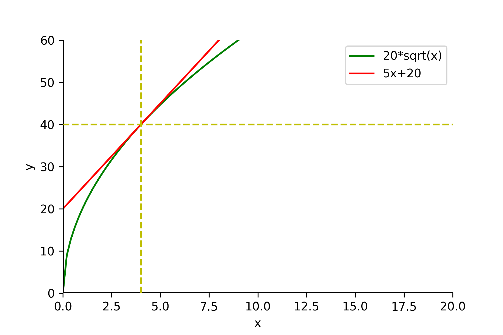

# Производные и интегралы - 01. Дифференцируем функции

Композиция функций $f$ и $g$ $\rightarrow$ $g(f(x))$

## Аппроксимация функций

## Относительная погрешность

$$
относительная\ погрешность = \frac{разность\ между f(x)\ и\ g(x)\ после\ приращения}{приращение\ x}
$$

Для $2.01$ относительная погрешность:

$$
\frac{f(2.01) - g(2.01)}{0.01} = \frac{(2.01)^2 - 4\cdot(2.01 - 1)}{0.01} =
$$
$$
\frac{4.0401 - 4.04}{0.01} = \frac{0.0001}{0.01} = 0.01 \rightarrow 1\%
$$

Для $2.1$ относительная погрешность:

$$
\frac{f(2.1) - g(2.1)}{0.1} = \frac{4.41 - 4.4}{0.1} = \frac{0.01}{0.1} = 0.1 \rightarrow 10\%
$$

Чем ближе к $2$, тем лучше $g(x)$ апроксимирует $f(x)$.

Если приращение $x \rightarrow 0$, то и относительная погрешность $\rightarrow 0$.

## Применение производных

Будем апроксимировать функцию $f(x) = 20 \cdot \sqrt{x}$ функцией $g(x)$ в окрестностях точки $x=4$.

Выведем формулу касательной к кривой.

Вычислим наклон (тангенс угла наклона) функции $f(x)$ при $x=4$.

$$
\tg = \frac{f(4 + \epsilon) - f(4)}{\epsilon} = \frac{20\cdot \sqrt{4+\epsilon} - 20\cdot 2}{\epsilon} = 20\cdot\frac{\sqrt{4+\epsilon} - 2}{\epsilon} =
$$

$$
20\cdot\frac{\sqrt{4+\epsilon} - 2}{\epsilon} \cdot \frac{\sqrt{4+\epsilon} + 2}{\sqrt{4+\epsilon} + 2} = 20 \cdot \frac{4 + \epsilon - 4}{\epsilon \cdot (\sqrt{4 + \epsilon} + 2)} = \frac{20}{\sqrt{4 + \epsilon} + 2}
$$

Если $\epsilon \rightarrow 0$, то $\sqrt{4 + \epsilon} + 2 \rightarrow 4$, а
$$
\tg \rightarrow \frac{20}{4} = 5
$$

$\Rightarrow$ апроксимирующая функция

$$
g(x) = a\cdot x + b = 5\cdot (x - 4) + 40 = 5\cdot x + 20
$$

## Вычисление производной

Представим функцию $f(x)$ в окрестности точки $x=a$ в виде линейной функции

$$
g(x) =k(x-a) + f(a)
$$

При этом $g(a)= f(a)$.

Нужно найти $k$.

Подсчитаем относительную погрешность при приращении $x$ от $x=a$ до $x=a+\epsilon$.

$$
относительная\ погрешность = \frac{разность\ между f(x)\ и\ g(x)\ после\ приращения}{приращение\ x} =
$$

$$
\frac{f(a+\epsilon) - g(a+\epsilon)}{\epsilon} = \frac{f(a+\epsilon) - (k\cdot\epsilon + f(a))}{\epsilon} =
$$
$$
 \underbrace{\frac{f(a+\epsilon) - f(a)}{\epsilon}}_{\rightarrow k - тангенс\ угла\ наклона} - k  \underset{\epsilon \rightarrow 0}{\rightarrow} 0
$$

Тогда
$$
k = \lim_{\epsilon\rightarrow 0}\frac{f(a+\epsilon) - f(a)}{\epsilon}
$$

При этом значении $k$, $g(x)$ - апроксимация функции $f(x)$, а $k$ - дифференциальный коэффициент $f(x)$ в точке $x = a$.

Наклон касательной к $y=f(x)$ в любой точке $(a, f(a))$ вычисляется как
$$
\lim_{\epsilon \rightarrow 0}\frac{f(a+\epsilon)-f(a)}{\epsilon} = f'(a)
$$

$f'(a)$ - производная функции $f$.

Операция получения производной называется *дифференцированием функции*.

$g(x)=f'(a)(x-a)+f(a)$ - линейная апроксимация функции для $f(x)$ в точке $a$.

$f'(x)$ - функция, выражающая наклон касательной к $f(x)$ в точке $(x, f(x))$ - производная $f(x)$.

$f'(x)$ - производная от $y=f(x)$, также обозначается
$$
y', \frac{dy}{dx}, \frac{df}{dx}, \frac{d}{dx}f(x)
$$

### Примеры

#### Производная от $f(x) = a$

$$
\lim_{\epsilon\rightarrow 0} \frac{f(a+\epsilon) - f(a)}{\epsilon} =
\lim_{\epsilon\rightarrow 0} \frac{a-a}{\epsilon} =
\lim_{\epsilon\rightarrow 0} 0 = 0
$$

$f'(x) = 0 \Rightarrow$ изменение постоянной функции $\rightarrow 0$.

#### Производная от $f(x) = \alpha\cdot x + \beta$

$$
\lim_{\epsilon\rightarrow 0} \frac{f(a+\epsilon) - f(a)}{\epsilon} =
\lim_{\epsilon\rightarrow 0} \frac{\alpha\cdot (a+\epsilon) + \beta -\alpha\cdot a - \beta}{\epsilon} =
$$
$$
\lim_{\epsilon\rightarrow 0}\frac{\alpha + \epsilon}{\epsilon} = \alpha
$$

Линейная функция имеет постоянную скорость изменения в $\forall$ точке.

#### Производная от $f(x) = x^2$

$$
\lim_{\epsilon\rightarrow 0} \frac{f(a+\epsilon) - f(a)}{\epsilon} =
\lim_{\epsilon\rightarrow 0} \frac{(a+\epsilon)^2 - a^2}{\epsilon} =
$$
$$
\lim_{\epsilon\rightarrow 0} \frac{2a\epsilon + \epsilon^2}{\epsilon} =
\lim_{\epsilon\rightarrow 0} 2a + \epsilon = 2a
$$

Получаем $f'(x) = 2x$

## Упражнения

### 1
Имеется функция $f(x)$ и линейная функция $g(x) = 8x + 10$. Известно, что относительная погрешность этих функций стремится к нулю при $x$, стремящихся к $5$.

* Найти $f(5)$

    $f(5) = g(5) = 50$

* Найти $f'(5)$

    $f'(5) = 8$

### 2
Имеется функция $f(x) = x^3$. Найти ее производную - $f'(x)$.

$$
\lim_{\epsilon \rightarrow 0} \frac{f(\alpha + \epsilon) - f(\alpha)}{\epsilon} = \lim_{\epsilon \rightarrow 0} \frac{(\alpha + \epsilon)^3 - \alpha^3}{\epsilon} =
$$

$$
\lim_{\epsilon \rightarrow 0} \frac{3 \alpha^2\epsilon + 3 \alpha \epsilon^2 + \epsilon^2}{\epsilon} = \lim_{\epsilon \rightarrow 0}(3 \alpha^2 + 3 \alpha \epsilon + \epsilon^2) =3 \alpha^2
$$

$$
f'(x) = 3 x^2
$$
