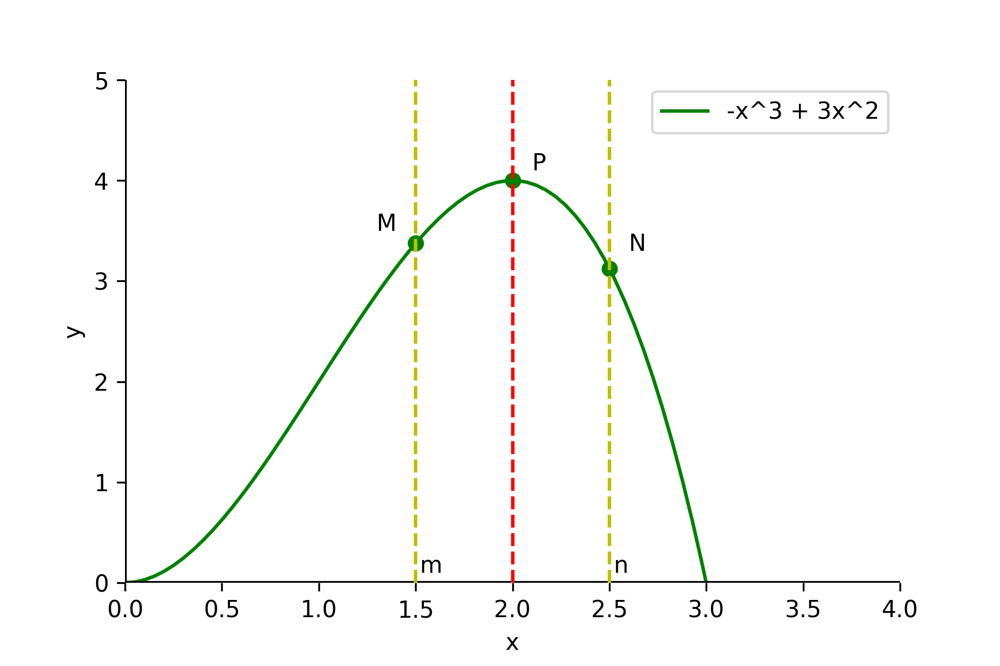
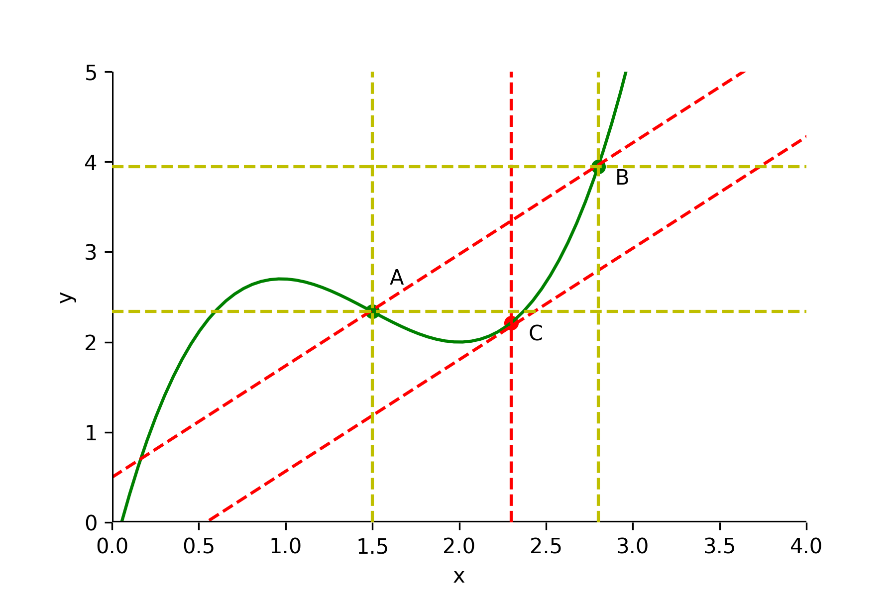

# Производные и интегралы - 02. Изучаем приемы дифференцирования

## Производная суммы функций

$$
h(x) = f(x) + g(x) \Rightarrow h'(x) = f'(x) + g'(x)
$$

Апроксимирует функции при $x=a$

$$
f(x) \approx f'(a)(x-a) + f(a)
$$

$$
g(x) \approx g'(a)(x-a) + g(a)
$$

Пусть $h(x) = f(x) + g(x) \approx k(x-a) + l$

$$
h(x) = f(x) + g(x) \approx  f'(a)(x-a) + f(a) + g'(a)(x-a) + g(a) =
$$
$$
\underbrace{(f'(a) + g'(a))}_{k = h'(a)}(x - a) + \underbrace{f(a) + g(a)}_{l}
$$
Получаем
$$
h'(x) = f'(x) + g'(x)
$$

**Производная - скорость**

$$
f(x) \approx f'(a)(x-a) + f(a)
$$

Следовательно

$$
f'(a) \approx  \frac{\overbrace{f(x) - f(a)}^{расстояние}}{\underbrace{x - a}_{время}} \Rightarrow f'(a) - скорость\ в\ точке\ a
$$

## Производная произведения функций

$$
h(x) = f(x) \cdot g(x) \Rightarrow h'(x) = f'(x)\cdot g(x) + f(x)\cdot g'(x)
$$

Апроксимирует функции при $x=a$

$$
f(x) \approx f'(a)(x-a) + f(a)
$$

$$
g(x) \approx g'(a)(x-a) + g(a)
$$

Пусть $h(x) = f(x) \cdot g(x) \approx k(x-a) + l$

$$
h(x) \approx (f'(a)(x-a) + f(a))\cdot(g'(a)(x-a) + g(a)) =
$$
$$
f'(a)\cdot(x-a)^2 \cdot g'(a) + f'(a)\cdot g(a)\cdot (x-a) + g'(a)\cdot f(a)\cdot (x-a) + f(a)\cdot g(a) =
$$
Так как $(x-a)$ - маленькое значение, то $(x-a)^2$ - очень малое и этим членом можно принебречь
$$
\underbrace{(f'(x)\cdot g(x) + f(x)\cdot g'(x))}_k\cdot (x - a) + \underbrace{f(a)\cdot g(a)}_l
$$

### Пример

Пусть $p(x)$ - зависимость цены, по которой можно продать товар, от количества товара - $x$.

$p'(x) < 0$, так как при увеличении объема товара цена понижается.

Доход - $h(x) =\ цена\ \times количество\ = p(x) \cdot x$.

$$
h(x) \approx h'(a)(x-a) + h(a)
$$

Тогда

$$
\underbrace{h(x) - h(a)}_{изменение\ дохода} \approx h'(a)\cdot \underbrace{(x - a)}_{изменение\ объема\ производства}
$$

Чтобы принять решение, увеличивать ли объем производства, нужно вычислить $h'(a)$ и сравнить результат со стоимостью производства товара.

$$
h(x) = p(x) \cdot x
$$

$$
h'(a) = p'(a)\cdot a + p(a)
$$

Рост выпуска нужно прекратить, если $p'(a)\cdot a + p(a)$, то есть доход, сравняется ос стоимостью производства единицы товара.

Так как $p'(a) < 0 \Rightarrow p(a)$ будет больше себестоимости.

Для того чтобы объем продаж увеличился на единицу, объем производства должен возрасти чуть больше.

$$
h'(a) = p'(a)\cdot a + p(a),\ где
$$

$p'(a)\cdot a$ - скорость снижения цены $\times$ количество товара $=$ общий убыток из-за снижения цены

$p(a)$ - увеличение дохода от продажи $a$-ой единицы по рыночной цене

Увеличивать выпуск можно пока $h'(a)$ не станет меньше стоимости производства добавочной единицы.

## Дифференцирование многочленов

### Формулы для дифференцирования многочленов

$$
 (f(x) + g(x))' = f'(x) + g'(x)
$$

$$
 (a\cdot f(x))' = a\cdot f'(x)
$$

$$
 (x^n)' = n\cdot x^{n-1}
$$

## Нахождение максимумов и минимумов

### Условия экстремумов

$y = f(x)$ имеет максимум или минимум в точке $x = a$, если $f'(a) = 0$.

### Условия возрастания и убывания

Если $f'(a) > 0$, то в точке $x = a$ функция $y = f(x)$ возрастает.

Если $f'(a) < 0$, то в точке $x = a$ функция $y = f(x)$ убывает.

Если $f'(a) = 0$, то в точке $x = a$ приближенная линейная функция равна константе $y = f'(a)(x - a) + f(a) = 0 \times (x - a) + f(a)$. Это формула горизонтальной касательной к кривой $f(x)$.

### Пузырьки

Газированные напитки перенасыщены углекислым газом. Он более стабилен в газообразном состоянии, чем когда растворен в жидкости.

Поэтому энергия пузырька уменьшается пропорционально его объему - $\frac{4}{3} \pi r^3$, где $r$ - радиус пузырька.

С другой стороны, на границе раздела между пузырьком и жидкостью действует поверхностное натяжение, стремясь уменьшить площадь поверхности.

Поэтому энергия пузырька из-за этой силы увеличивается пропорционально площади поверхности $4\pi r^2$.

Учитывая это выразим энергию $E(r)$ пузырька, как функцию от радиуса $r$.

$$
E(r) = - a (\frac{4}{3}\pi r^3) + b (4\pi r^2)
$$

Первое слагаемое - энергия, зависящаяот объема, а второе - энергия, зависящая от площади.

Пузырек стремится к уменьшению своей энергии, насколько это возможно.

Рассмотрим как ведет себя функция $E(r)$.

Пусть $a = 1$ и $b = 1$. Тогда зависимость энергии от $r$ упроститься до

$$
E(r) = - r^3 + 3 r^2
$$

Найдем экстремум

$$
E'(r) = -3r^2 + 6r = -3r(r-2)
$$

Если $r = 2$, то $E'(r) = 0$.

Если $0 < r < 2$, то $E'(r) > 0 \Rightarrow E(r)$ возрастает.

Если $r > 2$, то $E'(r) < 0 \Rightarrow E(r)$ убывает.

В точке $P$ при $r = 2$ функция $E(r)$ имеет максимум.

Пузырьки ведут себя по разному в зависимости от расположения относительно экстремума $P$.

Пузырек с радиусом $m$ и энергией $M$ начнет уменьшать свой радиус, чтобы уменьшить энергию. Он будет уменьшаться пока совсем не пропадет.

Пузырек с рариусом $n$ и энергией $N$, чтобы уменьшить энергию начнет увеличивать свой радиус. Он будет расти и выходить на поверхность.

## Теорема о среднем

Производная - это коэффиициент при $x$ в приближенной линейной функции, заменяющей функцию $f(x)$ в окрестностях точки $x = a$.

$$
f(x) \approx f'(a)(x - a) + f(a), при\ x\rightarrow a
$$

Но линейная функция - это только "приближение" $f(x)$, и для значения $b$, даже близкого к $a$ вообще говоря

$$
f(b) \not = f'(a)(b - a) + f(a),
$$
т.е. это не точное неравенство.

**Теорема о среднем**
>Для $\forall$ $a$ и $b$, таких, что $a < b$, найдется $\zeta$, удовлетворяющая условию $a < \zeta < b$, для которых выполняется равенство.

$$
f(b) = f'(\zeta)(b - a) + f(a)
$$

Другими словами можно записать уравнение
$$
f(b) \not = f'(a)(b - a) + f(a)
$$
со знаком равенства, используя не $f'(a)$, а $f'(\zeta)$ - значение производной в точке $\zeta$, расположенной между $a$ и $b$.

Тангенс угла наклона $AB$ равен

$$
\frac{\Delta y}{\Delta x} = \frac{f(b) - f(a)}{b - a}
$$

Будем перемещать линию $AB$ из начального положения. В итоге она должна достигнуть точки $C$, за которой уже не будет пересекаться с графиком. Это точка $(\zeta, f(\zeta))$.
В этой точке линия является касательной и значит ее наклон - $f'(\zeta)$.

Так как линия перемещалась параллельно ее начальному положению, то ее наклон не отличается от наклона

$$
\frac{f(b) - f(a)}{b - a} = f'(\zeta)
$$

Отсюда

$$
f(b) = f'(\zeta)(b - a) + f(a)
$$

## Производная частного от деления функций

Пусть дана функция $h(x) = \displaystyle \frac{g(x)}{f(x)}$.

Сначала найдем производную функции $p(x) = \displaystyle \frac{1}{f(x)}$

$$
1 = f(x) \cdot p(x)
$$

Тогда

$$
1 = f(x) \cdot p(x) \approx (f'(a)(x - a) + f(a))\cdot (p'(a)(x - a) + p(a))
$$

Так как левые части равны, то равны и их производные

$$
0 = p(a) \cdot f'(a) + f(a) \cdot p'(a)
$$

Имеем

$$
p'(a) = - \frac{p(a)\cdot f'(a)}{f(a)}
$$

Так как $p(a) = \displaystyle \frac{1}{f(a)}$, то $p'(a) = - \displaystyle \frac{f'(a)}{f(a)^2}$.

Запишем $h(x) = \displaystyle \frac{g(x)}{f(x)}$ в виде $h(x) = g(x) \cdot \displaystyle \frac{1}{f(x)} = g(x) \cdot p(x)$.

Применим правило умножения и предыдущую формулу

$$
h'(x) = g'(x)\cdot p(x) + g(x)\cdot p'(x) =
$$

$$
g'(x) \cdot \frac{1}{f(x)} - g(x) \cdot \frac{f'(x)}{f(x)^2} =
$$

$$
\frac{g'(x)\cdot f(x) - g(x)\cdot f'(x)}{f(x)^2}
$$

Получаем
$$
h'(x) = \frac{g'(x)\cdot f(x) - g(x)\cdot f'(x)}{f(x)^2}
$$

## Производная сложной функции

Пусть дана функция $h(x) = g(f(x))$.

В окрестностях точки $x = a$

$$
f(x) - f(a) \approx f'(a)(x - a),
$$

а в окрестностях точки $y = b$

$$
g(y) - g(b) \approx g'(b)(y - b),
$$

Подставляем $b = f(a)$ и $y = f(x)$ в последнее выражение и получаем в окрестностях $x = a$

$$
g(f(x)) - g(f(a)) \approx g'(f(a)) \cdot (f(x) - f(a))
$$

Заменяем $f(x) - f(a)$ на $f'(a)(x - a)$ из формулы выше. Получаем

$$
g(f(x)) - g(f(a)) \approx g'(f(a)) \cdot f'(a)(x - a)
$$

Так как $g(f(x)) = h(x)$, то коэффициент при $(x - a)$ дает

$$
h'(a) = g'(f(a)) \cdot f'(a)
$$

В итоге имеем

$$
h'(x) = g'(f(x)) \cdot f'(x)
$$

## Производная обратной функции

Используем полученнуюю выше формулу, чтобы найти производную функции $x = g(y)$, обратой функции $y = f(x)$.

Так как $x = g(f(x))$, для $\forall$ $x$, то дифференцирование обоих частей этого выражения дает

$$
1 = g'(f(x)) \cdot f'(x)
$$

В итоге получаем
$$
g'(y) = \frac{1}{f'(x)}
$$

## Формулы для дифференцирования

**Умножение на константу**
$$
(\alpha f(x))' = \alpha f'(x)
$$

**Степенная фукнция - $x^n$**
$$
(x^n)' = n x^{n-1}
$$

**Сумма**
$$
(f(x) + g(x))' = f'(x) + g'(x)
$$

**Произведение**
$$
(f(x) \cdot g(x))' = f'(x)\cdot g(x) + f(x)\cdot g'(x)
$$

**Частное**
$$
\frac{f(x)}{g(x)} = \frac{f'(x)\cdot g(x) - f(x)\cdot g'(x)}{g(x)^2}
$$

**Сложные функции**
$$
g(f(x))' = g'(f(x))\cdot f'(x)
$$

**Обратные функции**
$$
g'(y) = \frac{1}{f'(x)}
$$

## Упражнения

### 1
Для натурального $n$ найти производную $f'(x)$ для
$$
f'(x) = \frac{1}{x^n}
$$

$$
f'(x)=-\frac{(x^n)'}{(x^n)^2}=-\frac{n x^{n-1}}{x^{2n}}=-\frac{n}{x^{n-1}}
$$

### 2
Вычислить экстремумы $f(x) = x^3 - 12$

$$
f'(x)= 3x^2 - 12 = 3(x-2)(x+2)
$$

$f'(x) > 0$ при $x < -2$, $f'(x) < 0$ при $-2 \lt x \lt 2$ и $f'(x)\gt 0$ при $x > 2$.

То есть при $x = -2$ имеем максимум $f(-2) = 16$, а при $x = 2$ имеем максимум $f(2) = -16$.

Так как $f(x)=(1-x)^3$ - функция $g(h(x))$, состоящая из $g(x)=x^3$ и $h(x)= 1 - x$, то $f'(x) = g'(h(x))\cdot h'(x) = 3(1-x)^2(-1)=-3(1-x)^2$.

### 3
Найти производную $f'(x)$ для $f(x) = (1 - x)^3$

Находим производную функции $g(x)=x^2(1-x)^3$:

$$
g'(x) = (x^2)'(1-x)^3+ x^2((1-x)^3)'= 2x(1-x)^3+x^2(-3(1-x)^2)=
$$

$$
x(1-x)^2(2(1-x) - 3x)=x(1-x)^2(2-5x)
$$

$g'(x) = 0$ при $\displaystyle x=\frac{2}{5}$ и $x = 1$

Так как $g(1) = 0$, то максимум достигается в точке $\displaystyle x = \frac{2}{5}$ и равен $\displaystyle g\left(\frac{2}{5}\right) = \frac{108}{3125}$

### 4
Вычислить максимальное значение $g(x) = x^2 (1 - x)^3$ в интервале $0 \leq x \leq 1$
