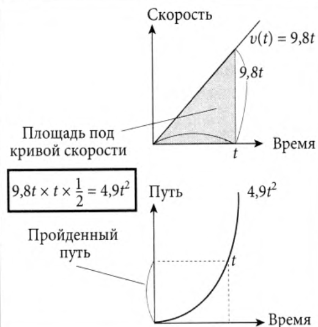

# Производные и интегралы - 03. Интегрируем функции

## Найдем концентрацию спирта

Когда в стакан со спиртом добавляют горячую воду, то концентрация спирта вверху становится меньше, чем внизу.

Концентрация на высоте $x$ см от дна выражается через $p(x)$  в $\frac{г}{см^3}$.

### Шаг 1. Если концентрация постоянна

$$
Количество\ спирта\ = 0.1 \cdot 9 \cdot 20 = 18\ грамм
$$

### Шаг 2. Если концентрация меняется ступенчато

$$
Количество\ спирта\ = ( 0.3 \cdot 2 + 0.2 \cdot 4 + 0.1 \cdot 3 ) \times 20 = 34\ грамма
$$

### Шаг 3. Если концентрация меняется постоянно

Представим функцию в виде ступенек

$$
\left\{ \begin{array}{lcl}
Количество\ спирта & \approx & p(x_0) \times (x_1 - x_0) \times 20 \\
& + & p(x_1) \times (x_2 - x_1) \times 20 \\
& \vdots & \\
& + & p(x_5) \times (x_6 - x_5) \times 20 \\
  \end{array} \right.
$$

### Шаг 4. Представление в виде линейной функции

Пусть $f'(x)$ - производная $f(x)$. Тогда вблизи точки $x = a$

$$
f(x) \approx f'(a)(x - a) + f(a)
$$

$$
f(x) - f(a)\approx f'(a)(x - a)
$$
Предположим, что разность между соседними последовательными значениями $x_0, x_1, \cdots ,x_6$ достоточно мала, так что $x_1 \rightarrow x_0$, $x_2 \rightarrow x_1$ и т.д.

Введем новую функцию $q(x)$, производная которой равна $p(x)$.
$$
q'(x) = p(x)
$$

Получаем
$$
q(x_1) - q(x_0) \approx p(x_0)(x_1 - x_0)
$$

$$
q(x_2) - q(x_1) \approx p(x_1)(x_2 - x_1)
$$

$$
\vdots
$$

$$
q(x_6) - q(x_5) \approx p(x_5)(x_6 - x_5)
$$

Просуммируем левую и правую части
$$
q(x_6) - q(x_0) \approx p(x_0)(x_1 - x_0) + p(x_1)(x_2 - x_1) + \cdots + p(x_5)(x_6 - x_5)
$$

### Шаг 5. От приближения к точному значению

$$
Количество\ спирта \approx \left( p(x_0)(x_1 - x_0) + p(x_1)(x_2 - x_1) + \cdots + p(x_5)(x_6 - x_5)\right)\times 20 \approx
$$

$$
\approx \left( q(x_6) - q(x_0) \right)\times 20 = \left( q(9) - q(0) \right)\times 20
$$

Если теперь увеличивать количество ступенек, то будет увеличиваться и точность, но сумма все равно будет равна $q(9) - q(0)$.

#### Строгое объяснение

Найдем $q'(x) = p(x)$.

Отложим на оси $x$ точки $x_0(=a), x_1, x_2, \ldots , x_n(=b)$.

Из теоремы о среднем находим точку $x_{01}$, расположенную между $x_0$ и $x_1$ и удовлетворяющую условию

$$
q(x_1) - q(x_0) = q'(x_{01})\cdot (x_1 - x_0)
$$

Аналогично находим точку $x_{12}$, расположенную между $x_1$ и $x_2$ и удовлетворяющую условию

$$
q(x_2) - q(x_1) = q'(x_{12})\cdot (x_2 - x_1)
$$

Повторяем эту операцию

$$
\left.
\begin{array}{ccccc}
q(x_1) - q(x_0) & = & q'(x_{01})\cdot (x_1 - x_0) & = & p(x_{01})(x_1 - x_0) \\
q(x_2) - q(x_1) & = & q'(x_{12})\cdot (x_2 - x_1) & = & p(x_{12})(x_2 - x_1) \\
\vdots \\
q(x_6) - q(x_5) & = & q'(x_{56})\cdot (x_6 - x_5) & = & p(x_{56})(x_6 - x_5) \\
\end{array} \right.
$$

Просуммируем и получим
$$
q(x_6) - q(x_0) = приближенное\ значение\ площади
$$

При переходе к бесконечно малым отрезкам получим точное значение площади.

### Шаг 6. $p(x)$ - это производная от $q(x)$

Пусть $q(x) = - \displaystyle\frac{2}{x + 1}$,

а $q'(x) = \displaystyle\frac{2}{(x + 1)^2} = p(x)$

$p(x)$ - это производная $q(x)$.

$q(x)$ - это _первообразная_ $p(x)$.

$$
Количество\ спирта = \left( q(9) - q(0) \right)\times 20 = (- \displaystyle\frac{2}{9 + 1} - (- \frac{2}{0 + 1}))\times 20 = 36\ грамм
$$

## Основная теорема интегрирования

Выражение
$$
p(x_0)(x_1 - x_0) + p(x_1)(x_2 - x_1) + \cdots + p(x_5)(x_6 - x_5)
$$

Представляют в виде
$$
\sum\limits_{x = x_0, x_1, \ldots, x_6} p(x) \Delta x \rightarrow \int\limits_0^9 p(x) \Delta x \rightarrow \int\limits_0^9 p(x) dx
$$

Это определенный интеграл

$$
\int\limits_a^b p(x) dx = q(b) - q(a)
$$

## Применение формул интегрирования

### Основные формулы интегрирования

$$
\int\limits_a^b f(x) dx + \int\limits_b^c f(x) dx = \int\limits_a^c f(x) dx
$$

$$
\int\limits_a^b ( f(x) + g(x) ) dx = \int\limits_a^b f(x) dx + \int\limits_a^b g(x) dx
$$

$$
\int\limits_a^b \alpha \cdot f(x) dx = \alpha \cdot \int\limits_a^b f(x) dxs
$$

## Применение основной теоремы интегрирования

### Экономическая задача

#### Кривая предложения

Как компании достигают максимальной прибыли на абсолютно конкурентном рынке.

Прибыль $P(x)$ при производстве $x$ единицц товара вычисляется:
$$
P(x) = p \times x - C(x),
$$
где $p$ - цена единицы товара, $C(x)$ - себестоимость производства.

Обозначим за $x_s$ количество продукции, при котором достигается максимум прибыли $P(x)$.

Максимальная прибыль достигается при

$$
P'(x_s) = 0
$$

$$
p - C'(x) = 0
$$

Функция $p = C'(x)$, соответствующая максимальной прибыли, называется _кривой предложения_.

На графике в точке $A$ цена равна $p_1$.
Этой цене соответствует оптимальный объем продукции $x_{s1}$.

Площадь прямоугольника $(p_1, A, x_{s1}, 0)$ равна произведению цены на количество изготовленной и проданной продукции.

Она равна доходу компании, до вычета затрат на производство.

Площадь (1) - это производственные затраты (себестоимость).
$$
Себестоимость\ = \int\limits_0^{x_{s1}} C'(x_s) d x_s = C(x_{s1}) - C(0) = C(x_{s1})
$$

Будем считать, что $C(0) = 0$.

Прибыль компании равна площади области (2).

#### Кривая спроса

Найдем максимальную выгоду покупки для потребителей.

$$
B(x) = u(x) - p \times x,
$$
где $B(x)$ - выгода, получаемая потребителем при покупке $x$ единиц товара, $u(x)$ - общие расходы, $p$ -цена товара, $x$ - количество продукции.

$u(x)$ - суммарная величина максимальных расходов, которые готовы понести потребители при покупке товара, суммарное количество которого равно $x$.

Больше всего товара пользователи купят при максимальном значении $B(x)$.

Чтобы найти оптимальное количество товара $x_b$, при покупке которого будет достигнута максимальная выгода, нужно решить уравнение:

$$
B'(x_b) = 0
$$

$$
u'(x_b) - p = 0
$$

Функция $p = u'(x)$ называется __кривой спроса__.

Рассмотрим площадь прямоугольника (3).
Она равна произведнию цены на количество купленных товаров и представляет собой общую стоимость купленных потребителями товаров.

Суммарную площадь областей (3) и (4) можно вычислить так.

$$
Общие\ расходы\ = \int\limits_0^{x_{b1}} u'(x_b) d x_b = u(x_{b1}) - u(0) = u(x_{b1})
$$

Считаем, что $u(0) = 0$.

Можно найти площадь (4), соответствующую выгоде для потребителей, которая равна разности между максимально приемлемым для потребителей значением расходов и реальной оплатой за товар (3).

Сумма прибыли для компании и выгода для потребителей равна общей выгоде для общества, которой на следующем рисунке соответствует закрашенная область.

Что будет, если цена товара или его количество не будут соответствовать точке $E$?

Общая выгода для общества уменьшается на значение, соответствующее пустой площади на графике.

### Интеграл скорости

$$
Интеграл\ скорости\ = Разность\ крайних\ положений\ = Путь
$$

Как найти путь, пройденный объектом, если скорость непрарывно меняется?
Объект двигается по движущейся дорожке.

Объект проходит точки $y_1, y_2, y_3$ в моменты времени $x_1, x_2, x_3$.

Производная пути - это скорость.

$y = F(x)$ - функция изменения положения объекта во времени

$F'(x)$ - "мгновенная скорость" в момент времени $x$.

Заменяя $F'(x)$ на обозначение скорости имеем
$$
\int\limits_a^b v(x) dx = F(b) - F(a)
$$

Ниже находится график, отражающий изменение скорости объекта во времени.

Закрашенная часть равна интегралу в левой части предыдущего равенства.

Пройденный путь, определяемый как разность положений, равен закрашенной области, т.е. интегралу скорости.

Пройденный путь увеличивается, если скорость положительна, и уменьшается, когда она отрицательна, т.е. в это время объект возвращается.

### Свободное падение тела

Увеличение скорости при свободном падении тела вызвано ускорением свободного падения $9.8\ м/с^2$.

Интеграл скорости - это разность положений (или пройденный путь).

Выражение для вычисления расстояния, которое пройдет тело за $T$ секунд падения

$$
F(T) - F(0) = \int\limits_0^T v(x) dx = \int\limits_0^T 9.8 \cdot x\ dx
$$

$$
F(T) - F(0) = \frac{9.8}{2} \cdot T^2 - 0 = 4.9 \cdot T
$$

Для башни высотой $333$ метра
$$
333 = 4.9 \cdot T^2 \rightarrow T = \sqrt{\displaystyle\frac{333}{4.9}} = 8.2\ c
$$

Тело достигнет земли через $8.2$ секунды (не учитывая сопротивление воздуха).

### Игральный кости

Вероятность выпадения любой цифры равна $1/6$.

Функция плотности вероятности

Функция распределения вероятности

Для нахождения вероятности выпадения $x$ в интервале $a \le x \le b$ множно использовать формулу

$$
\int\limits_a^b f(x) dx = F(b) - F(a)
$$

$f(x)$ - это производная $F(x)$

## Сводка по основной теореме интегрирования

Если функция $f(x)$ - производная $F(x)$, т.е. $F'(x) = f(x)$, то
$$
\int\limits_a^b f(x) dx = F(b) - F(a)
$$
или
$$
\int\limits_a^b F'(x) dx = F(b) - F(a)
$$

Это значит, что **интеграл производной от исходной функции на отрезке от $a$ до $b$** равен **разности между значениями исходной функции в точках $b$ и $a$**.

**Площадь фигуры, образованной графиком производной от исходной функции, осью $X$ и вертикальными отрезками, построенными из точек $x=a$ и $x=b$** равна **приращению значений исходной функции на отрезке от $a$ до $b$**.

### Интегрирование методом подстановки

Дан определенный интеграл по $x$

$$
S = \int\limits_a^b f(x) dx
$$

Подставим вместо $x$ функцию $x = g(y)$.

Запишем формулу, выражающую определенный интеграл через сумму ступенчатой функции
$$
S \approx \sum\limits_{k = 0, 1, \ldots, n-1} f(x_k)\cdot (x_{k+1} - x_k),\ где\ x_0 = a, x_n = b
$$

Заменяя переменную $x$ на $x=g(y)$, мы перейдем к новой переменной $y$ и получим следующие значения точек разбиения
$$
y_0 = \alpha, y_1, y_2, \ldots, y_n = \beta
$$

удовлетворяющие соотношениям
$$
a = g(\alpha), x_1 = g(y_1), x_2 = g(y_2), \ldots, b = g(\beta)
$$

Используя приближенную линейную функцию, выразим приращение $x$ через $y$
$$
x_{k+1} - x_k = g(y_{k+1}) - g(y_k) \approx g'(y_k)\cdot(y_{k+1} - y_k)
$$
и подставим его в выражение для $S$
$$
S \approx \sum\limits_{k = 0, 1, \ldots, n-1} f(x_k)\cdot (x_{k+1} - x_k) \approx \sum\limits_{k = 0, 1, \ldots, n-1} f(g(y_k)) \cdot g'(y_k)\cdot(y_{k+1} - y_k)
$$

Переход от суммы к интегралу при бесконечном числе разбиений даст нам следующую формулу:
$$
S = \int\limits_a^b f(x) dx = \int\limits_\alpha^\beta f(g(y)) \cdot g'(y) dy
$$

### Пример
Найти
$$
\int\limits_0^1 10\cdot(2x + 1)^4 dx
$$

Возьмем функцию $y = 2x + 1$.

Тогда
$$
x = g(x) = \frac{1}{2}(y - 1)
$$

Дифференцируем правую и левую части уравнения $y = 2x + 1$.

Получаем
$$
dy = 2 dx\ или\ dx = \frac{1}{2} dy
$$

Перепишем интеграл через новую переменную $y$ и учитываем, что границы интегрирования изменились, имеем
$$
0 \rightarrow 2\cdot 0 + 1 = 1
$$

$$
1 \rightarrow 2\cdot 1 + 1 = 3
$$

$$
\int\limits_0^1 10\cdot(2x + 1)^4 dx = \int\limits_1^3 10\cdot y^4\frac{1}{2} dy = \int\limits_1^3 5\cdot y^4 dy = 3^5 - 1^5 = 242
$$

## Упражнения

### 1
Найти определенный интеграл
$$
\int_2^3 3 x^2 dx = x^3 \Big|_1^3 = 3^3 - 1^3 = 26
$$

$$
\int_2^4 \frac{x^3 + 1}{x^2} dx = \int_2^4 (x + \frac{1}{x^2}) dx = \int_2^4 x dx + \int_2^4 \frac{1}{x^2} dx =
$$

$$
\frac{1}{2}(4^2 - 2^2) - \left(\frac{1}{4} - \frac{2}{4}\right) = \frac{25}{4}
$$

$$
\int_0^5 x + (1 + x^2)^7 dx + \int_0^5 x - (1 + x^2)^7 dx = \int_0^5 2 x dx = x^2 \Big|_0^5 =5^2 -0^2 = 25
$$

### 2

Записать выражение для определенного интеграла, равного площади фигуры, ограниченной кривой функции $y = f(x) = x^2 - 3x$ и осью $x$ и найти площадь этой фигуры

Площадь между графиком $y = f(x) = x^2 - 3x$ И осью $x$ равна $- \displaystyle \int_0^3 x^2 - 3x dx$

$$
- \int_0^3 x^2 - 3x dx = - \left(\frac{1}{3} x^3 - \frac{3}{2} x^2\right) \Big|_0^3 = - \frac{1}{3} (3^3 - 0^3) + \frac{3}{2} (3^2 - 0^2) = \frac{9}{2}
$$
