# Производные и интегралы - 04. Изучаем приемы интегрирования

## Танцы и тригонометрические функции
Функция косинуса

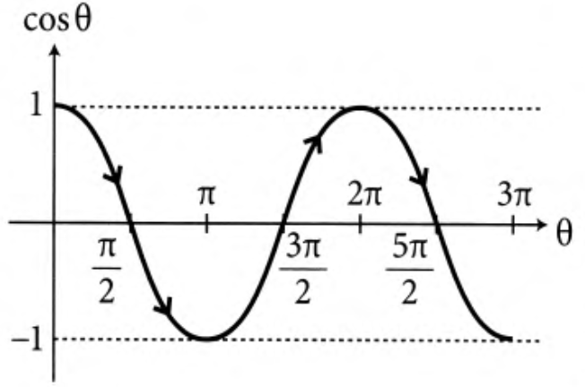

Круг радиуса $1$ с центром в точке $(0,0)$.

Если двигаться из точки $A$ по окружности к точке $P$, сдвинутой на угол $\theta$, то дуга $AP$ равно углу $\theta$, выраженному в радианах.

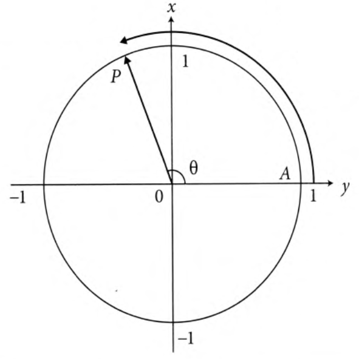

Вся окружность равна $360^{\circ}$ или $2\pi$ в радианах. Тогда $90^{\circ} = \pi / 2$, $180^{\circ} = \pi$.

Один радиан $\approx 57.2958^{\circ}$.

Тановщицы двигаются по окружности

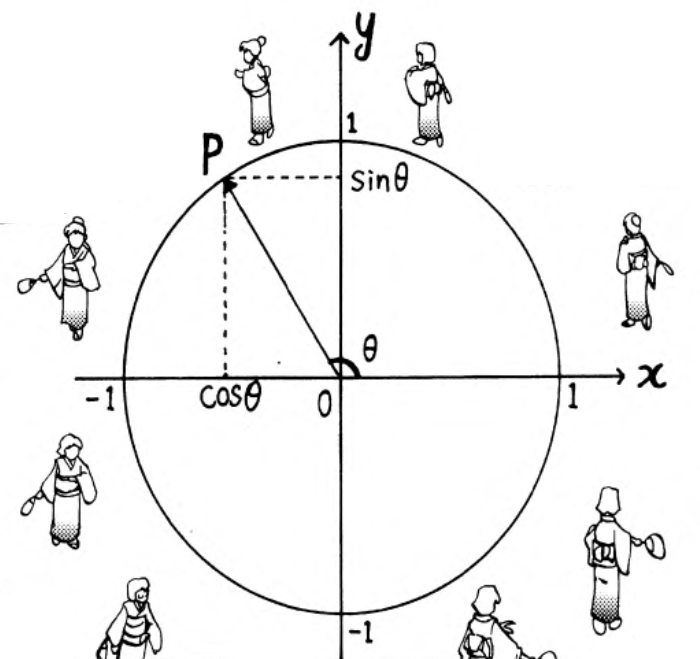

Смещение по горизонтали (относительно оси $x$) можно выразить через угол $\theta$, как $x = \cos \theta$.

Смещение по вертикали (относительно оси $y$) можно выразить через угол $\theta$, как $y = \sin \theta$.

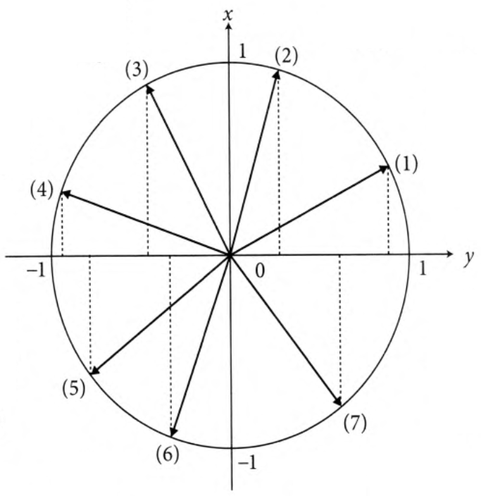

При увеличении $\theta$ значение $\cos \theta$ меняется последовательно от $1$ до $0$, далее до $-1$, назад до $0$, и наконец снова возвращается к $1$.

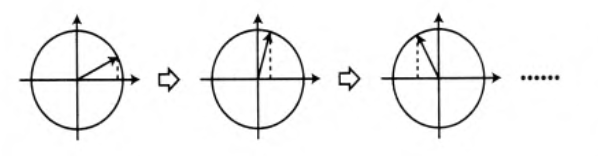

## Косинус и тень

Если лучи солнца направлены вертикально на налочку, то длина тени равна длине палочки, умноженной на $\cos \theta$.

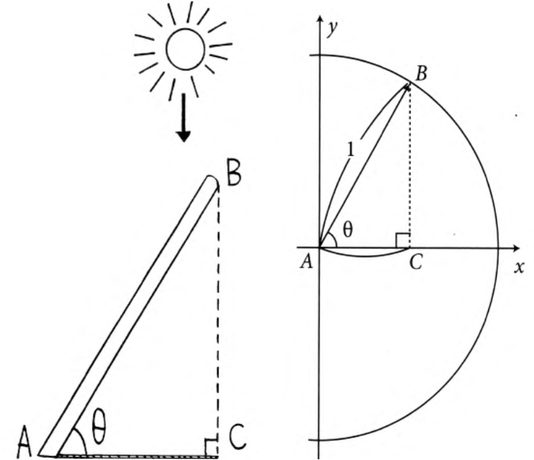

По определению
$$
\cos \theta = \frac{AC(тень)}{AB(палочка)},\ следовательно,\ длина\ тени\ = AB\times \cos \theta
$$

$\cos \theta$ показывает насколько тень короче самой палочки.

Если повернуть ось $x$ на угол $\pi / 2$, то она совпадет с осью $y$. Это означает, что функция $\sin \theta$, совпадает с функцией $\cos \theta$.

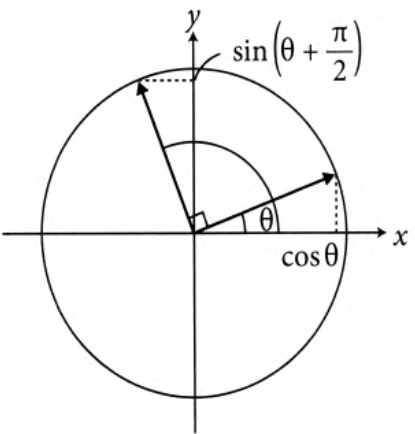

$$
\sin (\theta + \pi / 2) = \cos \theta
$$

$$
\cos (\theta + \pi / 2) = - \sin \theta
$$

## Интегрирование тригонометрических функций

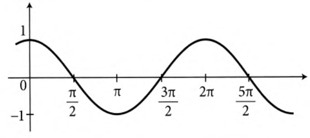

Найдем значение сумм
$$
\sum \cos \theta \times \Delta \theta = \cos \theta_0 \cdot (\theta_1 - \theta_0) + \cos \theta_1 \cdot (\theta_2 - \theta_1) + \ldots + \cos \theta_{n - 1} \cdot (\theta_n - \theta_{n - 1})
$$

Если точка $P$ образованаповоротом точки $(1, 0)$ на угол $\theta$, то улог между касательной $PQ$ и осью $y$ также равен $\theta$.

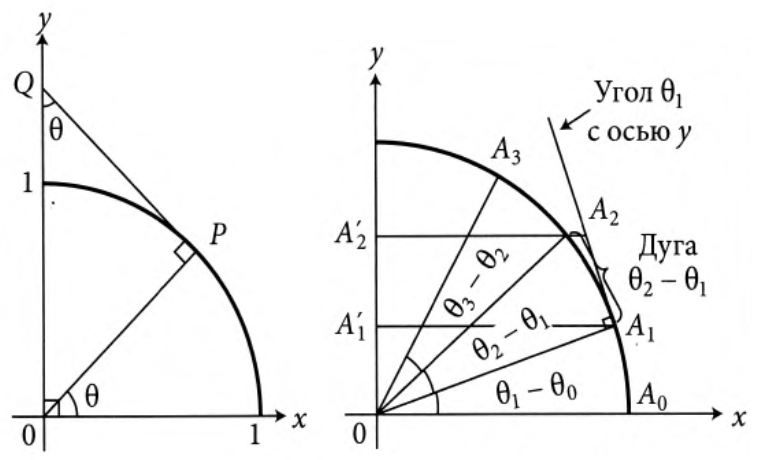

Так как $A'_1, A'_2$ - ортогональная проекция $A_1 A_2$ на ось $y$, то длина $A'_1 A'_2 \approx\ дуга\ A_1 A_2 \times \cos \theta_1 = (\theta_2 - \theta_1)\times \cos \theta_1$.

Используем эти равенства, чтобы найти интеграл $\cos \theta$ от $0$ до $\alpha$.

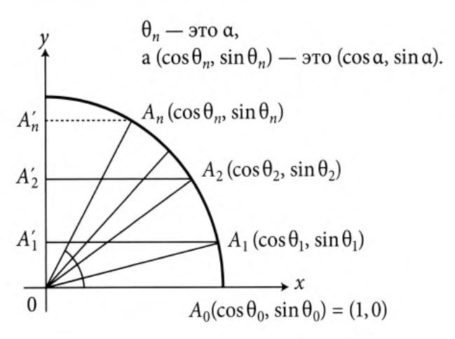

Интеграл косинуса угла $\theta$ от $0$ до $\alpha$ равен сумме $\cos \theta \times \Delta \theta$, при изменении $\theta$ от $0$ до $\alpha$

$$
\cos \theta_0 \cdot (\theta_1 - \theta_0) + \cos \theta_1 \cdot (\theta_2 - \theta_1) + \ldots + \cos \theta_{n - 1} \cdot (\theta_n - \theta_{n - 1}) \approx
$$

$$
A'_0 A'_1 + A'_1 A'_2 + \ldots + A'_{n - 1} A'_n = A'_0 A'_n = \sin \alpha
$$

Если уменьшить $\Delta \theta$ бесконечно, т.е. $\Delta \theta \rightarrow 0$, то
$$
\int\limits_0^\alpha \cos \theta d \theta = \sin \alpha - \sin 0
$$

Верно и обратное утверждение
$$

(sin \theta)' = \cos \theta
$$

Заменяем $\theta$ на $\theta + \pi / 2$ и получаем $(\sin (\theta + \pi / 2))' = \cos (\theta + \pi / 2)$

$$
(\cos \theta)' = - \sin \theta
$$

## Показательная и логарифмическая функции

Пусть экономический рост составляет $10%$ в год.

Тогда каждый год валовой продукт $G_0$ будет увеличиваться в $1.1$ раза.

Через $n$ лет

$$
G_1 = G_0\times 1.1
$$

$$
G_2 = G_1\times 1.1 = G_0\times 1.21
$$

$$
G_3 = G_0\times 1.33
$$

$$
G_4 = G_0\times 1.46
$$

$$
G_5 = G_0\times 1.61
$$

и наконец

$$
G_n = G_0\times 1.1^n
$$

Эффективность экономики, имеющей коэффициент прироста $a$, выражается показательной функцией $f(x) = a_0\cdot (1 + a)^x$

Показательная функция - функция вида $f(x) = a_0\cdot a^x$

Для функции $f(x)$, обратная функция $g(y)$ следующая

$$
g(f(x)) = x, f(g(y)) = y
$$

Для показательной функции $f(x) = 2^x$, обратная функция $g(y) = \log_2 y$ - логарифмическая функция.

## Обощение показательной и логарифмической функции

$$
годовой\ темп\ роста\ = \frac{значение\ через\ год\ - текущее\ значение}{текущее\ значение} = \frac{f(x + 1) - f(x)}{f(x)}
$$

Вычислим мгновенные темп роста

$$
мгновенный\ темп\ роста\ =
$$

$$
\ предел(\frac{значение\ чуть\ позже\ -\ исходное\ значение}{исходное\ значение}\times \frac{1}{приращение\ времени})=
$$

$$
\frac{f(x + \epsilon) - f(x)}{f(x)}\cdot \frac{1}{\epsilon},
$$

$$
\ при\ \epsilon\rightarrow 0 = \lim\limits_{\epsilon\rightarrow 0}(\frac{1}{f(x)}\cdot \frac{f(x + \epsilon) - f(x)}{\epsilon}) = \frac{1}{f(x)} \cdot f'(x)
$$

$$
\Rightarrow\ мгновенный\ темп\ роста\ = \frac{f'(x)}{f(x)}
$$

Найдем функцию $f(x)$, которой соответствует постоянное значение мгновенного темпа роста.

$$
\frac{f'(x)}{f(x)} = c = const
$$

Если $c=1$, то $f(x)$ должна удовлетворять условию $\displaystyle\frac{f'(x)}{f(x)} = 1$.

Предположим что $f(x)$ - это показательная функция.

Из условия $f'(x) = f(x)$, следует, что $f'(0) = f(0)$.

В окрестностях точки $h = 0$ мы можем записать

$$
f(h) \approx f(0) + f'(0)\cdot(h - 0),
$$
т.к. $f'(0) = f(0)$ имеем

$$
f(h) \approx f(0) + f(0)\cdot h = f(0)\cdot (1 + h)
$$

Если $x$ достаточно близко к $h$, то

$$
f(x) \approx f(h) + f'(h)\cdot (x - h)
$$

Заменим $x$ на $2h$ и используем условие $f'(h) = f(h)$.

Получаем

$$
f(2h) \approx f(h) + f(h)\cdot h = f(h)\cdot (1 + h)
$$

Подставим в это уравнение вместо $f(h)$ его приближенное значение

$$
f(2h) \approx f(0)\cdot (1 + h)\cdot (1 + h) = f(0)\cdot (1 + h)^2
$$

Аналогично можно получить выражение для $x = 3h, 4h, 5h, \ldots$

$$
f(mh) \approx f(0)\cdot (1 + h)^m
$$

Если $mh = 1$, то

$$
f(1) = f(mh) \approx f(0)(1 + h)^m
$$

Далее
$$
f(2) = f(2mh) \approx f(0)(1 + h)^2m
$$

$$
f(3) = f(3mh) \approx f(0)(1 + h)^3m
$$

Для произвольного $n$ имеем

$$
f(n) \approx f(0)\times a^n,\ где\ a = (1 + h)^m
$$

Полученное выражение - показательная функция.

Так как $mh = 1$, то $h = 1 / m$, и тогда
$$
f(1) \approx f(0)\cdot(1 + \frac{1}{m})^m.
$$

Если устремить $m$ к $\infty$, то $\displaystyle(1 + \frac{1}{m})^m$ будет стремиться к $e$ - числу Эйлера $\approx 2.718$.

Покажем, что функция $f(x)$ существует и найдем ее вид.

Обратная функция для $y = f(x) \rightarrow x = g (y)$.

Из условия $f'(x) = f(x)$, следует что производная равна самой функции.

Используем это
$$
g'(y) = \frac{1}{f'(x)},
$$

так как если $x = g(y)$ - функция обратная к $y = f(x)$, то $f'(x)\cdot g'(x) = 1$.

$$
g'(y) = \frac{1}{f'(x)} = \frac{1}{f(x)} = \frac{1}{y}
$$

Чтобы найти $g(\alpha)$ нам надо проинтегрировать ее производную на отрезке от $1$ от $\alpha$.

$$
\int\limits_1^\alpha g'(y)\ dy = \int\limits_1^\alpha \frac{1}{y}\ dy = g(\alpha) - g(1)
$$

Если принять $g(1) = 0$, то
$$
g(\alpha) = \int\limits_1^\alpha \frac{1}{y}\ dy
$$

Нарисуем график функции $\displaystyle z = \frac{1}{y}$/

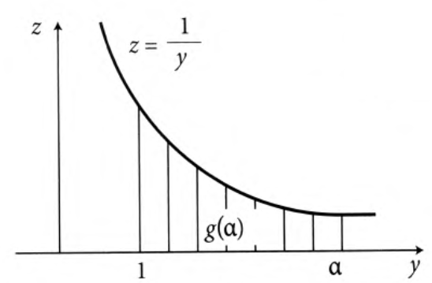

Функция $g(\alpha)$ - представляет собой площадь фигуры под кривой на отрезке от $1$ до $\alpha$. При этом получаем однозначно определяемую функцию $g(\alpha)$ для любого значения $\alpha$, включая дроби и иррациональные числа.

Функция $\displaystyle z = \frac{1}{y}$ - является явно заданной, т.е площадь под ней может быть найдена точно.

Так как $\displaystyle g(1) = \int\limits_1^1 \frac{1}{y}\ dy = 0$, то $\displaystyle \int\limits_1^\alpha \frac{1}{y}\ dy = g(\alpha) - g(1)$.

Мы нашли обратную функцию $g(y)$ через площадь под кривой, используя искомую функцию $f(x)$.

## Свойства показательной и логарифмической функции
1. Рассмотрим функцию темпа роста, $\displaystyle\frac{f'(x)}{f(x)}$.

2. Надо найти функцию $y = f(x)$, удовлетворяющую условию $\displaystyle\frac{f'(x)}{f(x)} = 1$, то есть имеющую постоянный темр роста равный $1$.

Указанному условию удовлетворяет показательная функция, для которй $f'(x) = f(x)$.

3. Производная обратной по отношению к $y = f(x)$ функции $x=g(y)$ равна
$$
g'(y) = \frac{1}{y}
$$

4. Значение функции $g(\alpha)$ равна площади под графиком функции $h(y) = \frac{1}{y}$

$$
g(\alpha) = \int\limits_1^\alpha \frac{1}{y}\ dy
$$

Обратная функция $f(x)$ - это функция, удовлетворяющая условию $g'(x) = \frac{1}{y}$ и для которой $g(1) = 0$.

5. Так как $f(x)$ - показательная функция, то используя константу $a_0$ можно записать

$$
f(x) = a_0 \cdot a^x
$$

Так как по пределению обратной функции $f(g(1)) = 1$, и в то же время из условия $g(1) = 0$ следует, что

$$
f(g(1)) = f(0) = a_0\cdot a^0 = a_0
$$

получаем

$$
f(g(1)) = 1 = a_0 \Rightarrow f(x) = a^x
$$

Рассуждая подобным образом находим

$$
f(g(e)) = f(1) = a^1\ и\ f(g(e)) = e \Rightarrow e = a^1
$$
и в конечном счете имеем

$$
f(x) = e^x
$$

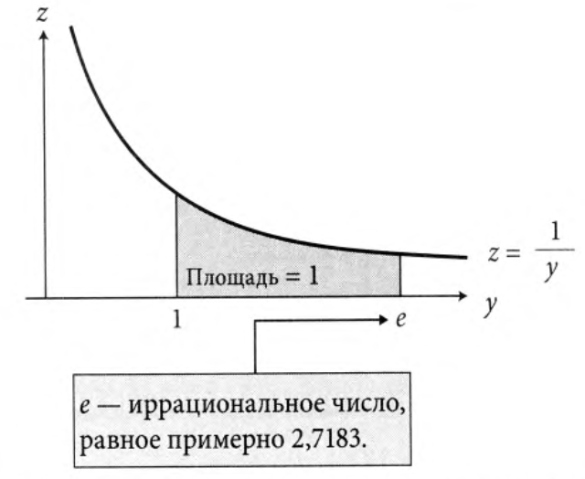

Значение основания натурального логарифма $e$ находится как число $y$, удовлетворяющее условию $g(y) = 1$. Другими словами, это число $\alpha$, для которого площадь между кривой $\displaystyle\frac{1}{y}$ и осью $y$ на отрезке от $1$ до $\alpha$ равна единице.

Обратная к ней функция $g(y)$ называется натуральным логарифмом и обозначается $\ln y = \log_e y$.

Перепишем часть предыдущих утверждений

* $f'(x) = f(x) \Leftrightarrow (e^x)' = e^x$

* $\displaystyle g'(y) = \frac{1}{y} \Leftrightarrow (\ln y)' = \frac{1}{y}$

* $\displaystyle g(\alpha) = \int\limits_1^\alpha \frac{1}{y}\ dy \Leftrightarrow \ln y =\int\limits_1^y \frac{1}{y}\ dy$

* Определим функцию $2^x$ для любого вещественного числа $x$. Для этого запишем ее в виде $f(x) = e^{(\ln 2)\cdot x}$, где $x$ - любое вещественное число.

Записанное следует из того, что $e^x$ и $\ln y$ - взаимно обратные функции, для которых можно записать
$$
e^{\ln 2} = 2
$$

В результате для $\forall$ натурального числа $x$ имеем $f(x) = (e^{\ln 2})^x = 2^x$.

## Другие применения основных теорем

### Дифференцирование степенной функции

Степенная функция $f(x) = x^a$ с отрицательным показателем степени может использоваться для записи таких функций как
$$
y = \frac{1}{x} = x ^ {-1}, y = \frac{1}{x^2} = x^{-2}, \ldots
$$

Для этих функция справедлива формула
$$
f(x) = x^a, f'(x) = a\cdot x^{a-1}
$$

#### Пример

$$
f(x) = \frac{1}{x^3}, \Rightarrow f'(x) = (x^{-3})' = -3\cdot x^{-4} = -\frac{3}{x^4}
$$

$$
f(x) = \sqrt[4]{x}, \Rightarrow f'(x)=(x^{\frac{1}{4}})' = \frac{1}{4}\cdot x^{\frac{-3}{4}} = \frac{1}{4\cdot \sqrt[4]{x^3}}
$$

#### Доказательство

Выразим функцию $f(x) = x^a$ через число $e$, используя равенство $e^{\ln x} = x$.

$$
f(x) = x^a = (e^{\ln x})^a = e^{a\ln x}
$$

Из полученного равенста следует, что
$$
\ln f(x) = a \ln x
$$

Возьмем производные от левой и правой частей этого уравнения, учитывая, что производная $\ln w = \displaystyle\frac{1}{w}$, и, применяя цепное правило дифференцирования сложной функции получим
$$
\frac{1}{f(x)} \times f'(x) = a \times \frac{1}{x}
$$

После несложных преобразований получаем
$$
f'(x) = a \times \frac{1}{x} \times f(x) = a \times \frac{1}{x} \times x^a = a\cdot x^{a-1}
$$

### Интегрирование по частям

Из правила дифференциования произведения двух функций следует, что если $h(x) = f(x)\cdot g(x)$, то

$$
h'(x) = f'(x)\cdot g(x) + f(x) \cdot g'(x)
$$

Таким образом, произведение $f(x)\cdot g(x)$ является первообразной для функции $f'(x)\cdot g(x) + f(x)\cdot g'(x)$.

Применяя основную теорему интегрирования, получаем
$$
\int\limits_a^b (f'(x)\cdot g(x) + f(x)\cdot g'(x))\ dx = f(b)\cdot g(b) - f(a)\cdot g(a)
$$
или
$$
\int\limits_a^b f'(x)\cdot g(x)\ dx + \int\limits_a^b f(x)\cdot g'(x)\ dx = f(b)\cdot g(b) - f(a)\cdot g(a)
$$

#### Пример
Вычислим интеграл

$$
\int\limits_0^\pi x \cdot \sin x\ dx
$$

Сделаем замену $f(x) = x, g(x) = \cos x$.

Тогда
$$
\int\limits_0^\pi x' \cos x\ dx + \int\limits_0^\pi x \cdot (\cos x)'\ dx = f(x)\cdot g(x)\Bigm|_0^\pi = f(\pi)\cdot g(\pi) - f(0)\cdot g(0)
$$

Подставляя выбранные нами функции вместо $f(x)$ и $g(x)$, получаем
$$
\pi \cdot \cos \pi - 0\cdot \cos 0 = \pi \cdot (-1) - 0 = \pi
$$

После преобразования получаем
$$
\int\limits_0^\pi x' \cos x\ dx + \int\limits_0^\pi x (\cos x)'\ dx =
$$

$$
\int\limits_0^\pi \cos x\ dx + \int\limits_0^\pi x (-\sin x)\ dx =
$$

$$
\int\limits_0^\pi \cos x\ dx - \int\limits_0^\pi x \sin x\ dx = -\pi
$$

Перепишем эти формулы относительно искомого интеграла
$$
\int\limits_0^\pi x\cdot \sin x\ dx = \int\limits_0^\pi \cos x\ dx + \pi = \sin x \Bigm|_0^\pi + \pi = \sin \pi - \sin 0 + \pi = \pi
$$

## Упражнения

### 1
Найти производную $\displaystyle \tg x \frac{\sin x}{\cos x}$

$$
(\tg x)' = \left( \frac{\sin x}{\cos x}\right)' = \frac{(\sin x)' \cos x - \sin x (\cos x)'}{\cos^2 x} =\frac{\cos^2 x + \sin^2 x}{\cos^2 x} = \frac{1}{\cos^2 x}
$$

### 2
Вычислить
$$
\int_0^{\frac{\pi}{4}} \frac{1}{\cos^2 x} dx = \tg\frac{\pi}{4} - \tg 0 = 1
$$

### 3
Найти значение $x$, при котором достигается минимум функции $f(x) = x e^x$

Вычисляем производную
$$
f'(x) =(x)'e^x +x (e^x)' = e^x + x e^x = (1 + x) e^x
$$

Приравниваем к нулю, находим $f'(-1) = 0$, отсюда минимум равен $\displaystyle f(-1) = \frac{1}{e}$

### 4
Вычислить $\displaystyle \int_1^e 2x \ln x dx$

Вводим обозначение $f(x) = x^2$, $g(x) = \ln x$, иинтегрируем по частям

$$
\int_1^e(x^2)' \ln x dx + \int_1^e x^2(\ln x)' dx =e^2 \ln e - \ln 1
$$

Таким образом,
$$
\int_1^e 2x \ln x dx +\int_1^e x^2 \frac{1}{x} dx =e^2
$$

$$
\int_1^e 2x \ln x dx = - \int_1^e x dx + e^2 = -\frac{1}{2} (e^2 - 1)^2 + e^2 =\frac{1}{2} e^2 + \frac{1}{2}
$$
