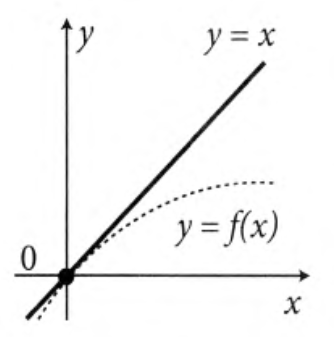
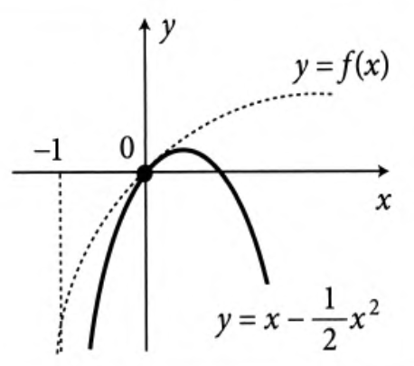
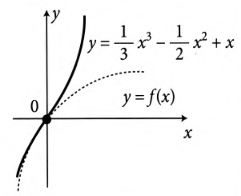
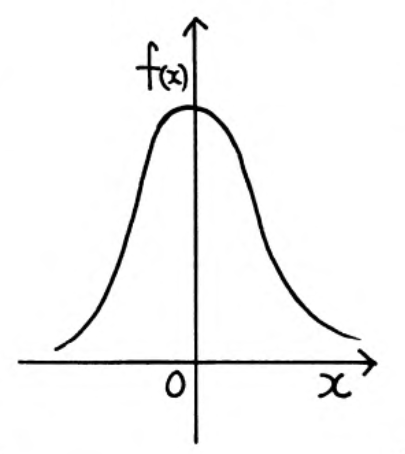
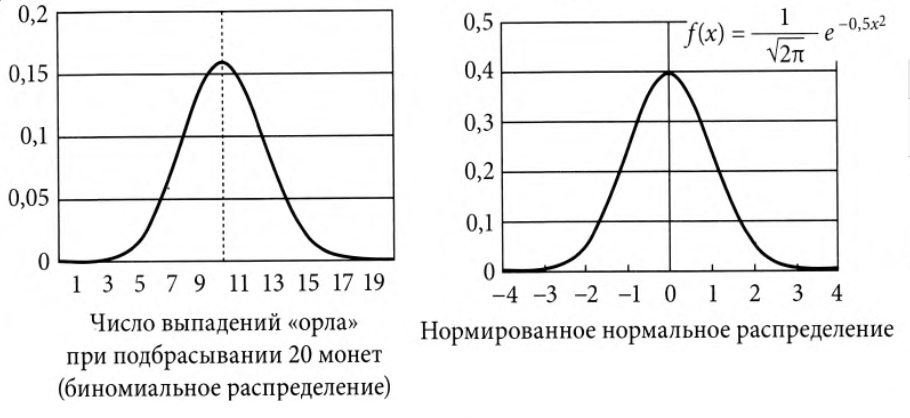
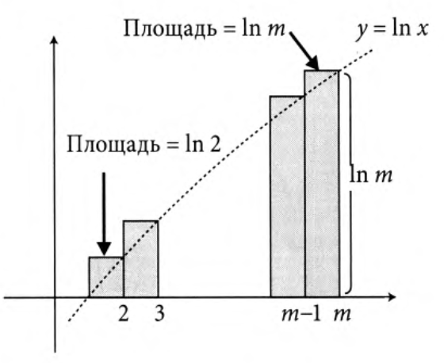

# Производные и интегралы - 05. Изучаем разложение в ряд Тейлора

## ?

Если для функции $f(x)$ найдем $p = f'(a)$ и $q = f(a)$, то сможем представить $f(x)$ в виде линейной функции $f(x) \approx q + p(x-a)$ вблизи точки $x = a$.

### Пример

Если взять кредит величины $M$ с годовой процентной ставкой $x$ и если вернуть его через год, то заплатишь $M\cdot(1+x)$, если через два года, то $M\cdot(1+x)\cdot(1+x)$, а через $n$ лет - $M\cdot(1+x)^n$.

$$
(1+x)^n = 1 + nx + \frac{n(n-1)}{2}x^2 + \frac{n(n-1)(n-2)}{6}x^3+ \cdots
$$

$$
(1+x)^n = 1 + C_1^n x + C_2^n x^2 + C_3^n x^3+ \cdots + C_n^n x^n,
$$
где
$$
C_n^k = \frac{n!}{k! (n-k)!}
$$

$$
C_n^1 = n, C_n^2 = \frac{n(n-1)}{2}, C_n^3 = \frac{n(n-1)(n-2)}{2\cdot 3}, C_n^r = \frac{n(n-1)(n-2)\cdots (n-(r-1))}{r!}
$$

Если оставить только два слагаемых, то получим представление $(1+x)^n$ в виде линейной функции $1 + nx$.

$$
(1 + x)^n \approx 1 + nx
$$

Такое представление слишком грубое.

Часто используют квадратичное приближение
$$
(1 + x)^n \approx 1 + nx + \frac{n(n-1)}{2}x^2
$$

Для $\forall$ пары $n$ и $x$, удовлетворяющей условию $nx = 0.7$ получаем
$$
(1+x)^n \approx 1 + nx + \frac{n(n-1)}{2}x^2 \approx 1 + nx + \frac{1}{2}(nx)^2 - \frac{1}{2} n x^2
$$
Принебрегаем последним слагаемымы в силу малости.
$$
(1+x)^n \approx 1 + 0.7 + \frac{1}{2}\times 0.7^2 = 1.945 \approx 2
$$

#### Закон долговой ямы

Если срок погашения кредита $\times$ процентная ставка $= 0.7$, то сумма долга увеличивается примерно вдвое.

Члены со степенью $n>1$ называют членами высокой степени.

Рассмотрим рассмотрение функции в виде многочлена более высокой степени.

Разложим
$$
f(x) = \frac{1}{1-x} = 1 + x + x^2 + x^3 + x^4 + \ldots
$$

Пусть $x = 0.1$, тогда
$$
f(0.1) = \frac{1}{1 - 0.1} = \frac{1}{0.9} = \frac{10}{9} = 1.111\ldots
$$

$$
f(0.1) = 1 + 0.1^2 + 0.1^3 + 0.1^4 + \ldots = 1 + 0.1 + 0.01 + 0.001 + \ldots = 1.111\ldots
$$

Если произвольная функция $f(x)$, дифференцируемая бесконечное число раз, может быть выражена в виде бесконечного ряда
$$
f(x) = a_0 + a_1 x + a_2 x^2 + a_3 x^3 + \ldots + a_n x^n + \ldots,
$$
то правую часть данной формулы называют разложением $f(x)$ в ряд Тейлора (в окрестностях точки $x = 0$).

Это значит, что $f(x)$ полностью совпадает с многочленом бесконечной степени в определенном интервала, включая $x = 0$.

Надо отметить, что за пределами интервала правая часть может не сходиться в определенному единственному значению и поэтому теряет смысл.

Например, при $x = 2$
$$
f(x) = \frac{1}{1 - 2} = -1 (левая\ часть)
$$

$$
f(x) = 1 + 2 + 4 + 8 + 16 + \ldots (правая\ часть)
$$

Выражение
$$
\frac{1}{1 - x} = 1 + x + x^2 + x^3 + \cdots
$$
верно только для $ -1 < x < 1$, т.е. внутри этого интервала допустимо разложение в ряд Тейлора.
Этот интервал называется _кругом сходимости_.

## Как получить разложение в ряд Тейлора

Пусть имеется разложение
$$
f(x) = a_0 + a_1 x + a_2 x^2 + a_3 x^3 + \ldots + a_n x^n + \ldots
$$

Для $x = 0$ имеем $f(0) = a_0$.

Возьмем производную от обеих частей.
$$
f'(x) = a_1 + 2 \cdot a_2\cdot x + 3\cdot a_3 \cdot x^2 + \ldots + n\cdot a_n \cdot x^{n - 1} + \ldots
$$

Подставим $x = 0$. Имеем $f'(0) = a_1$.

Дифференцируем еще раз.
$$
f''(x) = 2 \cdot a_2 + 6\cdot a_3 \cdot x + \ldots + n\cdot a_n \cdot (n - 1) \cdot x^{n - 2} + \ldots
$$

Подставим $x = 0$ имеем $f''(0) = 2\cdot a_2 \Rightarrow a_2 = \displaystyle\frac{1}{2}\cdot f''(0)$

Выполняя дифференцирование многократно получаем
$$
f^{(n)}(x) = n\times (n - 1)\times \ldots \times 2 \times 1 \times a_n + \ldots \Rightarrow a_n = \frac{1}{n!}f^{(n)}(0)
$$

### Пример

$f(x) = \displaystyle\frac{1}{1 - x}$

$$
f'(x) = \frac{1}{(1 - x)^2}, f''(x) = \frac{2}{(1 - x)^3}, f'''(x) = \frac{6}{(1 - x)^4}, \ldots
$$

$$
f(0) = 1, f'(0) = 1, f''(0) = 2, f'''(0) = 6, \ldots, f^{(n)}(0) = n!
$$

Имеем
$$
f(x) = f(0) + \frac{1}{1!}\cdot f'(0)\cdot x + \frac{1}{2!}\cdot f''(0)\cdot x^2 + \frac{1}{3!}\cdot f'''(0)\cdot x^3 + \ldots + \frac{1}{n!}\cdot f^{(n)}(0)\cdot x^n + \ldots =
$$

$$
1 + x + \frac{1}{2!}\cdot 2 \cdot x^2 + \frac{1}{3!}\cdot 6 \cdot x^3 + \ldots + \frac{1}{n!}\cdot n! \cdot x^n + \ldots =
$$

$$
1 + x + x^2 + x^3 + \ldots + x^n + \ldots
$$

Это формула для точного разложения в точке $x = 0$.

Для произвольной точки $x = a$ используется следующая формула.

$$
f(x) = f(a) + \frac{1}{1!}\cdot f'(a)\cdot (x - a) + \frac{1}{2!}\cdot f''(a)\cdot (x - a)^2 + \frac{1}{3!}\cdot f'''(a)\cdot (x - a)^3 + \ldots +
$$

$$
\frac{1}{n!}\cdot f^{(n)}(a)\cdot (x - a)^n + \ldots
$$

## Разложение различных функций в ряд Тейлора

### Разложение в ряд Тейлора для $f(x) = \sqrt{1 + x}$

$f(x) = \sqrt{1 + x} = (1 + x)^{1/2}$

$$
f'(x) = \frac{1}{2} (1 + x)^{-1/2},
f''(x) = -\frac{1}{2} \cdot \frac{1}{2} \cdot (1 + x)^{-3/2},
f'''(x) = -\frac{1}{2} \cdot \frac{1}{2} \cdot (1 + x)^{-3/2}
$$

$f(0) = 1$

$$
f'(0) = \frac{1}{2}, f''(0) = - \frac{1}{4}, f'''(0) = \frac{3}{8}, \ldots
$$

$$
\sqrt{1 + x} = 1 + \frac{1}{2}x + \frac{1}{2!}\cdot (-\frac{1}{4})x^2 + \frac{1}{3!}\cdot (\frac{3}{8})x^3 + \ldots
$$

$$
\sqrt{1 + x} = 1 + \frac{1}{2}x - \frac{1}{8} x^2 + \frac{1}{16}x^3 + \ldots
$$

### Разложение в ряд Тейлора для показательной функции $f(x) = e^x$
$$
f'(x) = e^x, f''(x) = e^x, f'''(x) = e^x, \ldots
$$

$$
e^x = 1 + \frac{1}{1!}x + \frac{1}{2!}x^2 + \frac{1}{3!} x^3 + \ldots + \frac{1}{n!} x^n + \ldots
$$

Пусть $x = 1$, получаем
$$
e = 1 + \frac{1}{1!} + \frac{1}{2!} + \frac{1}{3!} + \ldots + \frac{1}{n!} + \ldots
$$

### Разложение в ряд Тейлора для логарифмической функции $f(x) = \ln (1 + x)$
$$
f'(x) = \frac{1}{1 + x} = (1 + x)^{-1}, f''(x) = - (1 + x)^{-2}, f'''(x) = 2 (1 + x)^ {-3}, f''''(x) = -6 (1 + x)^{-4}, \ldots
$$

$$
f(0) = 0, f'(0) = 1, f''(0) = -1, f'''(0) = 2!, f''''(0) = -3!, \ldots
$$

$$
\ln (1 + x) = 0 + x - \frac{1}{2}x^2 + \frac{1}{3!}\cdot 2!\cdot x^3 - \frac{1}{4!}\cdot 3!\cdot x^4 + \ldots
$$

$$
\ln (1 + x) = x - \frac{1}{2}x^2 + \frac{1}{3}x^3 - \frac{1}{4}x^4 + \ldots + (-1)^{n + 1} \cdot \frac{1}{n}x^n
$$

### Разложение в ряд Тейлора для тригонометрических функциий$
$f(x) = \cos x$

$$
f'(x) = - \sin x, f''(x) = - \cos x, f'''(x) = \sin x, f''''(x) = \cos x, \ldots
$$

$$
\cos x = 1 + 0\cdot x - \frac{1}{2!}\cdot 1\cdot x^2 + \frac{1}{3!}\cdot 0\cdot x^3 + \frac{1}{4!}\cdot 1\cdot x^4 + \ldots
$$

$$
\cos x = 1 - \frac{1}{2!} x^2 + \frac{1}{4!} x^4 + \ldots + (-1)^n \cdot \frac{1}{(2n)!}\cdot x^{2n} + \ldots
$$

Аналогично

$$
\sin x = x - \frac{1}{3!} x^3 + \frac{1}{5!} x^5 + \ldots + (-1)^{n - 1} \cdot \frac{1}{(2n - 1)!}\cdot x^{2n - 1} + \ldots
$$

## Что дает разложение в ряд Тейлора

### Функция $\ln (1 + x)$

$$
\ln (1 + x) = x - \frac{1}{2}x^2 + \frac{1}{3}x^3 - \frac{1}{4}x^4 + \ldots
$$

#### Приближение $0$-го порядка
$$
\ln (1 + x) \approx 0
$$

Это значит, что $f(x) = 0$, при $x = 0$ и график проходит через точку $(0, 0)$.

#### Приближение $1$-го порядка (линейное приближение)
$$
\ln (1 + x) \approx x
$$
Линейное приближение - это уравнение касательной в рассматриваемой точке $x = 0$. Функция возрастает при $x = 0$.

#### Приближение $2$-го порядка (квадратичное приближение)

$$
\ln (1 + x) \approx x - \frac{1}{2}x^2
$$

Вблизи точки $x = 0$ функцию можно аппроксимировать данной функцией. График вогнут вниз при $x = 0$.

Квадратичное приближение позволяет найти, как изогнут графикв точке разложения в ряд.

#### Приближение $3$-го порядка (кубическое приближение)

$$
\ln (1 + x) \approx x - \frac{1}{2}x^2 + \frac{1}{3}x^3
$$

Позволяет уменьшить ошибку квадратичного приближения.

### Вероятность событий

Для описания вероятности событий часто используют нормальное распределение.

Плотность вероятности с точностью до постоянного множителя имеет вид
$$
f(x) = e^{-\frac{x^2}{2}}
$$

При подбрасывании монеты $20$ раз, число выпадений орла определяется биномиальным распределением.

Графики нормального и биномиального распределений практически совпадают.

Если запишем функцию $g(x)$, выражающую вероятность выпадения $x$ орлов при одновременном подбрасывании $n$ монет и устремим $n \rightarrow \infty$, то $g(x)$ будет пропорциональна функции нормального распределения.

$$
g(x) = C_n^x \cdot \left(\frac{1}{2}\right)^x \cdot \left(\frac{1}{2}\right)^{n-x} = C_n^x\cdot \left(\frac{1}{2}\right)^n
$$

Так как функция нормального распределения $f(x)$ симметрично относительно $0$, а $g(x)$ - относительно $x = \displaystyle\frac{1}{2}$, то сначала введем

$$
g_n\left(\frac{n}{2}\right) = C_n^{\frac{n}{2}}\cdot \left( \frac{1}{2}\right)^n
$$

и разделим $g_n(x)$ на $g_n(\frac{n}{2})$.

$$
h_n(x) = \frac{g_n(x)}{g_n(\displaystyle\frac{n}{2})} = \frac{C_n^x}{C_n^{\frac{n}{2}}} - \ нормированная функция
$$

Далее
$$
g_n(x) = g_n(\frac{n}{2})\cdot h_n(x)
$$

Имеем
$$
C_n^k = \frac{n!}{x!\cdot (n-x)!}, C_n^{\frac{n}{2}} = \frac{n!}{\left( \frac{n}{2}\right)! \cdot \left( \frac{n}{2}\right)!}
$$

$$
h_n(x) = \frac{\left( \frac{n}{2}\right)! \cdot \left( \frac{n}{2}\right)!}{x!\cdot (n-x)!}
$$

Теперь заменим единицу на $\displaystyle\frac{\sqrt{n}}{2}$, т.к. центр находится в точке $x = \displaystyle\frac{n}{2}$.

$\displaystyle\frac{\sqrt{n}}{2}$ - это стандартное отклонение.

Вводим новую переменную $z$, равную числу стандартных отклонений от центра.

$$
x = \frac{n}{2} + \frac{\sqrt{n}}{2}\times 1 \rightarrow z = 1
$$

$$
x = \frac{n}{2} + \frac{\sqrt{n}}{2}\times 2 \rightarrow z = 2
$$

$$
x = \frac{n}{2} + \frac{\sqrt{n}}{2}\times 3 \rightarrow z = 3
$$

Далее заменяем в $h_n$, $x$ на $x = \displaystyle\frac{n}{2} + \frac{\sqrt{n}}{2}\cdot z$

$$
h_n(x) = \frac{\left( \frac{n}{2}\right)! \cdot \left( \frac{n}{2}\right)!}{\left( \frac{n}{2} + \frac{\sqrt{n}}{2}\cdot z\right)!\cdot \left( \frac{n}{2} - \frac{\sqrt{n}}{2}\cdot z\right)!}
$$

Заметим, что
$$
\frac{n}{2} - \frac{\sqrt{n}}{2}\cdot z = \left( n - \left( \frac{n}{2} + \frac{\sqrt{n}}{2}\cdot z\right)\right)
$$

Логарифмируем
$$
\ln h_n(x) = \ln \left(\frac{n}{2}\right)! + \ln \left(\frac{n}{2}\right)! - \ln \left( \frac{n}{2} + \frac{\sqrt{n}}{2}\cdot z\right)!  - \ln \left( \frac{n}{2} - \frac{\sqrt{n}}{2}\cdot z\right)!
$$

Найдем приближение для $\ln m!$

$$
\ln m! = \ln 1 + \ln 2 + \ln 3 + \ldots + \ln m
$$

Если мы сложим площади закрашенных прямоугольников на графике $\ln x$, то получил
$$
\ln 2 + \ldots + \ln m \approx \int\limits_1^m \ln x\ dx
$$

Так как
$$
(x\ln x - x)' = \ln x + x \times \frac{1}{x} - 1 = \ln x,
$$

то используя основную теорему интегрирования можно записать

$$
\int\limits_1^m \ln x\ dx = (m \ln m - m) - (1 \ln 1 - 1) = m \ln m - m + 1 = m(\ln m - 1) + 1
$$

Нас интересуют большие значения $m$, для которых $\ln m \gg 1$. Поэтому принебрегаем $1$, получаем $\ln m! \approx m \ln m$.

Применяем полученную формулу

$$
\ln h_n(x) \approx \frac{n}{2} \ln \left( \frac{n}{2} \right) + \frac{n}{2} \ln \left(\frac{n}{2} \right) -
$$

$$
\left( \frac{n}{2} + \frac{\sqrt{n}}{2}\cdot z\right) \ln \left( \frac{n}{2} + \frac{\sqrt{n}}{2}\cdot z\right) -
$$

$$
\left( \frac{n}{2} - \frac{\sqrt{n}}{2}\cdot z\right) \ln \left( \frac{n}{2} - \frac{\sqrt{n}}{2}\cdot z\right)
$$

После замены
$$
\ln \left( \frac{n}{2} + \frac{\sqrt{n}}{2}\cdot z\right) = \ln \left( \frac{n}{2} \left( 1 + \frac{\sqrt{n}}{n}\cdot z\right)\right) = \ln \frac{n}{2} + \ln \left( 1 + \frac{\sqrt{n}}{n}\cdot z\right)
$$
и тождественных преобразований
$$
\ln h_n(x) \approx - \left[ \left( \frac{n}{2} + \frac{\sqrt{n}}{2}\cdot z \right)  \ln \left( 1 + \frac{\sqrt{n}}{n}\cdot z \right) + \left( \frac{n}{2} - \frac{\sqrt{n}}{2}\cdot z \right) \ln \left( 1 - \frac{\sqrt{n}}{n}\cdot z \right) \right ]
$$

При стремлении $t \rightarrow 0$ можно записать
$$
\ln (1 + t) \approx t - \frac{1}{2} t^2
$$

Из того, что $\displaystyle\frac{\sqrt{n}}{n} = \frac{1}{\sqrt{n}} \rightarrow 0$, если $n$ достаточно велико, можно считать, что для $\forall$ конечного $z$ значение выражения $\displaystyle\frac{\sqrt{n}}{n} z$ также стремиться к $0$.

В результате
$$
\ln (1 + \frac{\sqrt{n}}{n}z) \approx \frac{\sqrt{n}}{n}z - \frac{1}{2}\cdot \frac{1}{n}z^2
$$

$$
\ln (1 - \frac{\sqrt{n}}{n}z) \approx - \frac{\sqrt{n}}{n}z - \frac{1}{2}\cdot \frac{1}{n}z^2
$$

Подставляем это в наше выражение и получаем
$$
\ln h_n(x) \approx - \left[ \left( \frac{n}{2} + \frac{\sqrt{n}}{2}\cdot z \right)  \left(\frac{\sqrt{n}}{n}\cdot z - \frac{1}{2}\cdot \frac{1}{n}z^2\right) + \left( \frac{n}{2} - \frac{\sqrt{n}}{2}\cdot z \right) \left( - \frac{\sqrt{n}}{n}\cdot z - \frac{1}{2}\cdot \frac{1}{n}z^2 \right) \right ] =
$$

$$
- \left[ z^2 - \frac{1}{2} z^2 \right] = - \frac{1}{2} z^2
$$

Получил
$$
\ln h_n(x) \approx - \frac{1}{2}z^2
$$

Откуда после потенциирования следует
$$
h_n(x) \approx - e^{-\frac{1}{2}z^2}
$$

При разложении натурального логарифма в ряд Тейлора мы ограничились только членами $2$-го порядка, чтобы убедиться, что остальные члены можно не учитывать, надо вычислить $h_n(x)$, используя приближение

$$
\ln (1 + t) \approx t - \frac{1}{2}t^2 + \frac{1}{3} t^3
$$

Можно увидеть, что член $z^4$ имеет $n$ в знаменателе своего коэффициента, а значит сходится к $0$ и исчезает при $n \rightarrow \infty$.

## Упражнения

### 1
Найти разложение в ряд Тейлора функции $f(x) = e^{-x}$ при $x = 0$.

$$
f(x) = e^{-x}, f'(x) = -e^{-x}, f^{(2)}(x)=e^{-x}, f'(x) = -e^{-x}, \ldots
$$

$$
f(x) = 1 - \frac{1}{1!}x + \frac{1}{2!}x^3 - \frac{1}{3!}x^3 + \ldots
$$

### 2
Найти квадратичное приближение $\displaystyle f(x) = \frac{1}{\cos x}$ при $x = 0$

$$
f(x) = (\cos x)^{-1}, f'(x)=(\cos x)^{-2}\sin x, f^{(2)}(x) = 2 (\cos x)^{-3}(\sin x)^2 + (\cos x)^{-1}
$$

$$
f(0) = 1, f'(0) = 0, f^{(2)}(0) = 1
$$

$$
f(x) = 1 - \frac{1}{1!}x + \frac{1}{2!}x^3 + \ldots
$$

### 3
Вывести формулу разложения в ряд Тейлора функции $f(x)$ с центром в точке $x = a$ или другими словами найти значение коэффициентов $a_n$ в фомуле
$$
f(x) =a_0 +a_1 (x - a) + a_2 (x - a)^2 + \cdots a_n (x - a)^n + \cdots
$$
