# Производные и интегралы - 06. Изучаем частные производные

## Фунцкии нескольких переменных

Высота тела, брошенного вверх со скоростью $v$, через время $t$ задается функцией
$$
h(v,t) = vt - 4.9 \cdot t^2
$$

Концентрация сахарного сиропа, полученного растворением $y$ граммов сахара в $x$ граммах воды задается функцией
$$
f(x,y) = \frac{y}{x+y} \times 100
$$

Общее количество производимых товаров $Y$ (ВВП - валовой внутренний продукт) является функцией общего количества оборудования и станков $K$ (называемого капиталом) и количества работы $L$ - $Y(L,K)$.

В экономике ипользуют приближенную формулу Кобба-Дугласа
$$
Y(L,K) = \beta\cdot L^\alpha \cdot K^{1 - \alpha}, где\ \alpha, \beta - константы
$$

В физике давление идеального газа $P$, его объем $V$ и температура $T$ связаны между собой функцией
$$
T(P,V) =\gamma PV
$$

## Линейные функции нескольких переменных

Линейная функция двух переменных записывается как
$$
z = f(x,y) = ax + by + c, где\ a,b,c - константы
$$

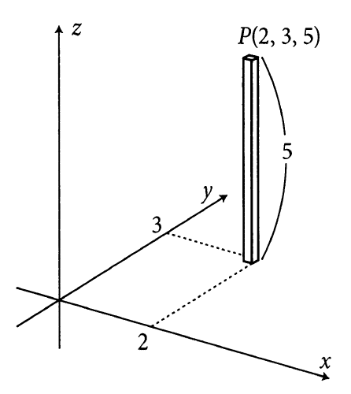

Нарисуем график функции $z=f(x,y)=3x+2y+1$.

$f(1,2) = 8$, $f(4,3) = 19$

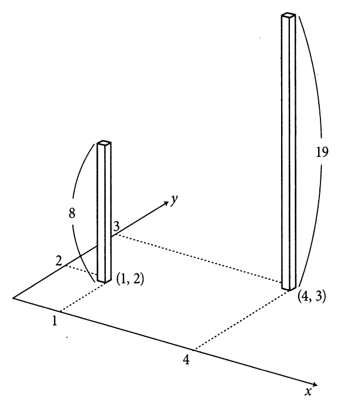

Построим $16$ точек для $1 \le x \le 4$ и $1 \le y \le 4$.

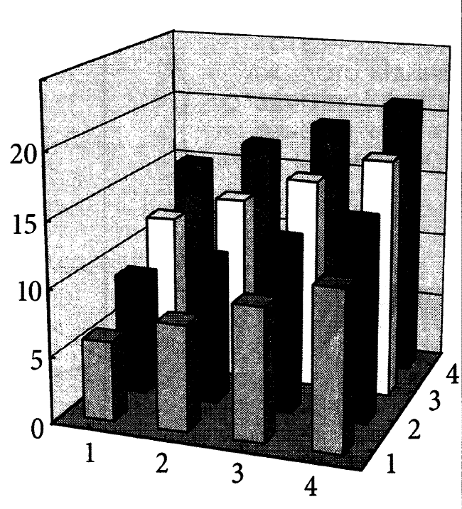

Ближние столбики соответствуют условию $y=1$ и превращаются в уравнение прямой линии $z = f(x,y) = 3x + 2\cdot 1 + 1 = 3x + 3$.

Для $y=2$ имеем $z = f(x,y) = 3x + 2\cdot 2 + 1 = 3x + 5$.

Получается, что каждый последующий ряд на $2$ выше предыдущего, т.е. вершины столбиков образуют плоскость.

Нарисуем график функции $z = f(x,y) = ax + by$. Из точки $O$ - $(0,0,0)$ проведем отрезок $OA$, соответствующий функции $z=ax$, т.е. приравняем $y=0$.

Аналогично построим отрезок $OB$, соответствующий функции $z=by$. Эти два отрезка определяют плоскость функции $f(x,y)$

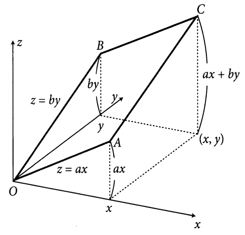

Чтобы получить график с учетом константы $c$, соответствующий $z=ax+by+c$, нужно поднять плоскость на величину $c$.

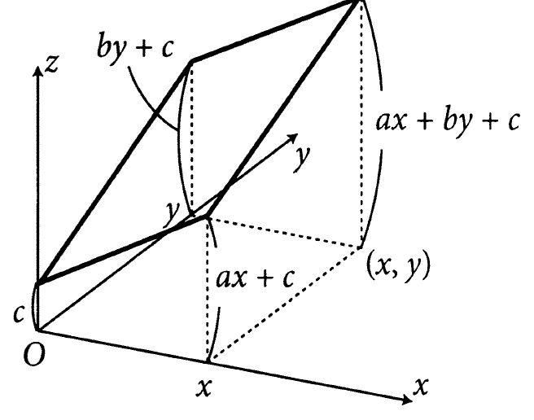

## Частные производные

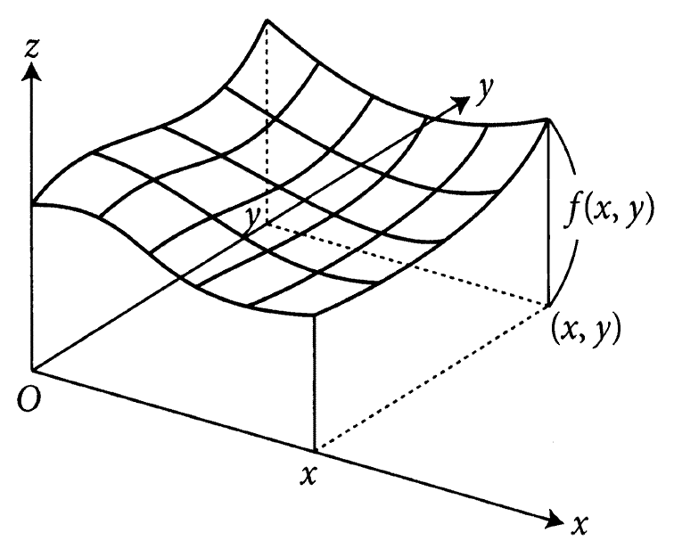

Будем апроксимировать исходную функцию $f(x,y)$ линейной функцией двух переменных вблизи точки $(a,b) \rightarrow (x=a, y=b)$.

Строим линейную функцию двух переменных, которая в точке $(a,b)$ имеет высоту $f(a,b)$ и описывается формулой
$$
L(x,y) = p(x-a) + q(y-b) + f(a,b)
$$

Заменяя $x$ на $a$ и $y$ на $b$, получаем
$$
L(a,b) = f(a,b)
$$

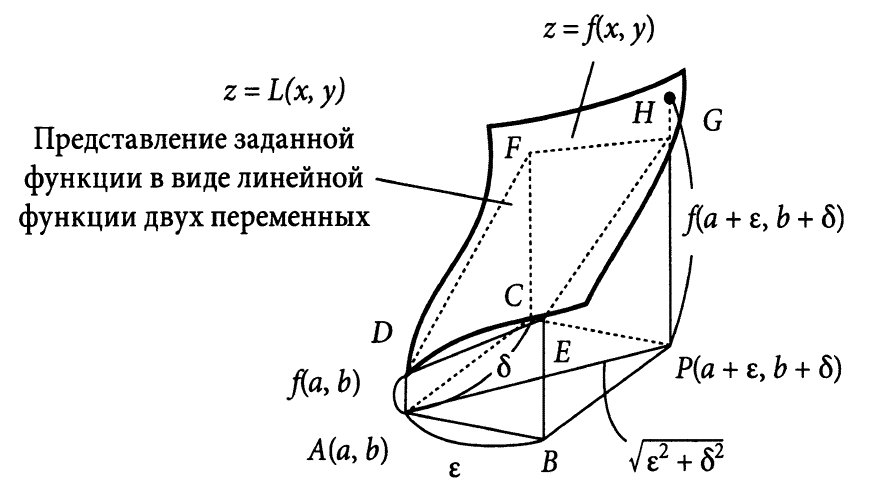

Значение функции $z=f(x,y)$ и апроксимирующей ее $z=L(x,y)$ в точке $P(a+\epsilon, b+\delta)$, смешенной относительно точки $A(a,b)$, отличается на некоторую величину.

Возникающая при этом погрешность равна:
$$
f(a+\epsilon, b+\delta) - L(a+\epsilon, b+\delta) = f(a+\epsilon, b+\delta)- f(a,b)-(p\epsilon+q\delta),
$$
а относительная погрешность (ОП) - отношение погрешности к длине $AD$.
$$
ОП\ =\frac{f(a+\epsilon, b+\delta)- f(a,b)-(p\epsilon+q\delta)}{\sqrt{\epsilon^2 + \delta^2}}
$$

Найдем значение $p$ и $q$, исходя из того, что раность между $f(x,y)$ и $L(x,y)$ стремится к $0$ при приближении точки $P$ к точке $A$.

На графике коэффициент $p$ равен тангенсу угла наклона $DE$, а коэффициент $q$ - тангенсу угла наклона $DF$.

Так как значения $\epsilon$ и $\delta$ могут быть любыми, приравняем $\delta=0$ и найдем значение
$$
ОП\ =\frac{f(a+\epsilon, b+0)- f(a,b)-(p\epsilon+q\times 0)}{\sqrt{\epsilon^2 + 0^2}} =
$$
$$
\frac{f(a+\epsilon, b)- f(a,b)}{\epsilon} - p
$$

Утверждение "относительная погрешность $\rightarrow 0$ при $\epsilon\rightarrow 0$" означает
$$
\lim_{\epsilon\rightarrow 0} \frac{f(a+\epsilon, b) - f(a,b)}{\epsilon} = p,
$$
где $p$ - тангенс угла наклона $DE$.

Левая часть данного уравнения - дифференцирование функции одной переменной.

Если заменить $y$ на постоянную $b$, то получим функцию $f(x,b)$ только от переменной $x$.

Левая часть - расчет производной этой функции при $x=a$.

При записи $f'(a,b)$ невозможно определенить, относительно чего, $x$ или $y$, мы дифференцируем.

Записывают $f_x(a,b)$ - производная $f(x,y)$ при $x=a$ и фиксированном $y=b$.

$f_x$ - называют _частной производной по $x$_.

Также используют обозначения
$$
\frac{\partial f}{\partial x}(a,b), \left[ \frac{\partial f}{\partial x}\right]_{x=a,y=b}
$$

Аналогично для $y$ - производная $f$ по $y$ при $y=b$ и фиксируемом $x=a$
$$
f_y(a,b), \frac{\partial f}{\partial y}(a,b), \left[ \frac{\partial f}{\partial y}\right]_{x=a,y=b}
$$

Если $z=f(x,y)$ имеет представление в виде линейной функции вблизи точки $(x,y) = (a,b)$, то
$$
z=f_x(a,b)(x-a) + f_y(a,b)(y-b) + f(a,b)
$$
или
$$
z=\frac{\partial f}{\partial x}(a,b)(x-a) + \frac{\partial f}{\partial y}(a,b)(y-b) + f(a,b)
$$

Рассмотрим произвольную точку $(\alpha, \beta)$ на круге с радиусом $1$ и центром в начале координат

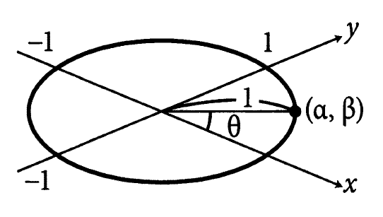

Имеем $\alpha^2 + \beta^2 = 1$ или $\alpha = \cos\theta$ и $\beta = \sin\theta$.

Найдем производную в направлении точки $(0,0)$ в точку $(\alpha, \beta)$.

Перемещение на расстояние $t$ в этом направлении записывается как $(a,b) \rightarrow (a + \alpha t, b + \beta t)$.

Если мы положим $\epsilon = \alpha t$ и $\delta = \beta t$, то получим

$$
ОП\ = \frac{f(a+\alpha t, b+\beta t) - f(a,b) - (p\alpha t + q\beta t)}{\sqrt{\alpha^2 t^2 + \beta^2 t^2}} =
$$

$$
\frac{f(a+\alpha t, b+\beta t) - f(a,b)}{t\cdot \sqrt{\alpha^2 + \beta^2}} - p \alpha - q \beta =
$$

учитываем, что $\alpha^2 + \beta^2 = 1$

$$
\frac{f(a+\alpha t, b+\beta t) - f(a,b)}{t} - p \alpha - q \beta
$$

Прибавим и вычтем вспомогательныое слагаемое, а также заменим $p=f_x(a,b)$ и $q = f_y(a,b)$ получаем
$$
ОП\ = \frac{f(a+\alpha t, b+\beta t) - f(a,b+\beta t)}{t} + \frac{f(a, b+\beta t) - f(a,b)}{t}-f_x(a,b)\alpha - f_y(a,b)\beta
$$

Используя производную по $x$ функции $f(x, b+\beta t)$ для линейного приближения в точке $x=a$, можно записать, что
$$
f(a+\alpha t, b+\beta t) - f(a,b+\beta t) \approx f_x(a,b+\beta t)\alpha t
$$

Аналогично для $y$ получим
$$
f(a+\alpha t, b+\beta t) - f(a,b+\beta t) \approx f_y(a,b+\beta t)\beta t
$$

Подставляем
$$
ОП\ \approx f_x(a,b+\beta t)\alpha + f_y(a,b)\beta - f_x(a,b)\alpha - f_y(a,b)\beta =
$$

$$
\left(f_x(a,b+ \beta t) - f_x(a,b)\right) \alpha
$$

Так как $f_x(a,b+\beta t) - f_x(a,b)\approx 0$, если $t$ достаточно близко к $0$, то и предыдущее выражение, представляющее относительную погрешность, тоже близко к $0$, т.е. $ОП\ \rightarrow 0$, при $AP \rightarrow 0$ для любого направления $AP$

При этом $f_x$ должна быть гладкой (без изломов), чтобы можно было утверждать, что $f_x(a, b+\beta t) - f_x(a,b) \approx 0$.

При наличии изломов нельзя сказать, существует ли производная в любом направлении, даже если существуют производные $f_x$ и $f_y$.

### Пример 1

Рассмотрим функцию $h(v,t)= vt - 4.9 t^2$.

Найдем ее частную производную в точке $(v,t)=(100,5)$.

Дифференцируя $h(v,5) = 5v - 122.5$ в направлении $v$
$$
\frac{\partial h}{\partial v}(v,5) \Rightarrow \frac{\partial h}{\partial v}(100,5)=h_v(100,5) = 5
$$

Дифференцируем $h(100,t)=100 t - 4.9 t^2$ в направлении $t$.

$$
\frac{\partial h}{\partial t}(100,t) = 100 - 9.8 t
$$

$$
\frac{\partial h}{\partial t}(100,5) = h_t(100,5) = 100 - 9.8 \times 5 = 51
$$

Получаем
$$
L(x,y) = 5(v-100) + 51(t-5) - 377.5
$$

Для произвольных значений $h$ и $t$ частные производные будут равны
$$
\frac{\partial h}{\partial v} = t, \frac{\partial h}{\partial t}=v-9.8 t
$$

Если подставить эти частные производные в уравнение
$$
z=f_x(a,b)(x-a) + f_y(a,b)(y-b) + f(a,b),
$$
то вблизи точки $(v,t) = (v_0, t_0)$

$$
h(v,t) \approx t_0(v-v_0)+(v_0-9.8 t_0)(t-t_0)+h(v_0, t_0)
$$

### Пример 2

Найдем линейное приближение для сахарного сиропа, полученного из $y$ граммов сахара и $x$ граммов воды

$$
f(x,y) = \frac{100 y}{x + y}
$$

Дифференцируем по $dx$ и $dy$. Получаем

$$
\frac{\partial f}{\partial x} = f_x = - \frac{100 y}{(x+y)^2}
$$

$$
\frac{\partial f}{\partial y} = f_y = \frac{100(x+y) - 100y \times 1}{(x+y)^2} = \frac{100 x}{(x + y)^2},
$$

т.е. вблизи точки $(x,y) = (a,b)$ имеем

$$
f(x,y) \approx - \frac{100 b}{(a+b)^2} (x-a) + \frac{100 a}{(a+b)^2} (y-b) + \frac{100 b}{a+b}
$$

### Частное дифференцирование

Если $z=f(x,y)$ дифференцируема по $x$ в любой точке пространства $(x,y)$, то функция $f(x,y) \rightarrow f_x(x,y)$, связывающая точку $(x,y)$ с ее частной производной $f_x(x,y)$ по $x$ в этой точке, называется _функцией частной производной по $x$_ от функции $z=f(x,y)$ и обозначается
$$
f_x, f_x(x,y), \frac{\partial f}{\partial x}\ или\  \frac{\partial z}{\partial x}
$$

Аналогично, если $z=f(x,y)$ дифференцируема по $y$ в любой точке пространства $(x,y)$, то функция $f(x,y) \rightarrow f_y(x,y)$, называется _функцией частной производной по $y$_ от функции $z=f(x,y)$ и обозначается
$$
f_y, f_y(x,y), \frac{\partial f}{\partial y}\ или\  \frac{\partial z}{\partial y}
$$

Нахождение частных производных функций называется ее _частным дифференцированием_

## Полные дифференциалы

Представление $z=f(x,y)$ линейной функцией в точке $(x,y) = (a,b)$ имеет вид
$$
f(x,y) \approx f_x(a,b)(x-a) + f_y(a,b)(y-b) + f(a,b)
$$

Перепишем это как
$$
f(x,y) - f(a,b) \approx f_x(a,b)(x-a) + f_y(a,b)(y-b)
$$

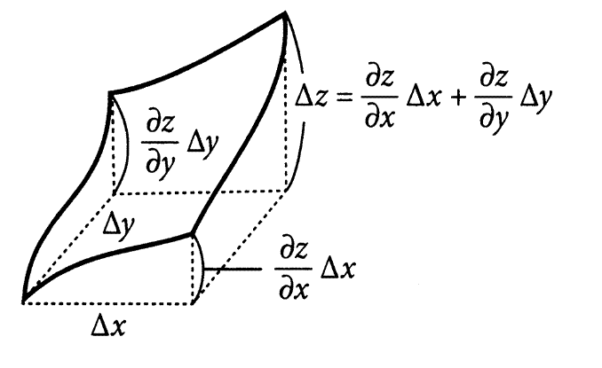

Разность $f(x,y) - f(a,b)$ обозначает приращение $z=f(x,y)$ при переходе от точки $(a,b)$ к точке $(x,y)$. Запищем ее как $\Delta z$.

Соответственно $(x-a) = \Delta x$ и $(y-b) = \Delta y$.

Тогда
$$
\Delta z \approx \frac{\partial z}{\partial x}\Delta x + \frac{\partial z}{\partial y}\Delta y
$$

Это означает: если $x$ увеличивается относительно $a$ на $\Delta x$, а $y$ - относительно $b$ на $\Delta y$, то $z = f(x,y)$ увеличивается на
$$
\frac{\partial z}{\partial x}\Delta x + \frac{\partial z}{\partial y}\Delta y
$$

Так как $\displaystyle \frac{\partial z}{\partial x}\Delta x$ - это приращение $z$ по $x$ при $y=b$, а $\displaystyle \frac{\partial z}{\partial y}\Delta y$ приращение по $z$ по $y$ при $x=a$, то $\displaystyle \frac{\partial z}{\partial x}\Delta x + \frac{\partial z}{\partial y}\Delta y$ - сумма приращений по $x$ и $y$.

При стремлении приращений по $x$ и $y$ к нулю, заменяя $\Delta$ на $d$ получаем _формулу полного дифференциала_.
$$
d z = \frac{\partial z}{\partial x}d x + \frac{\partial z}{\partial y}d y
$$
или
$$
df(x,y) = f_x dx +f_y dy
$$

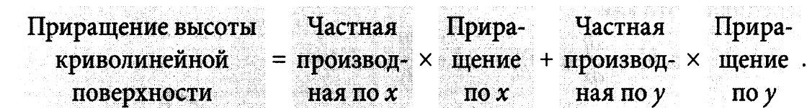

### Пример

Найдем выражение полного дифференциала для предыдущегно примера про давление идеального газа $P$, его объема $V$ и температуры $T$, которые связаны между собой функцией
$$
T(P,V) =\gamma PV
$$

Перепишем уравнение в упрощенном виде - $T=PV$.

Тогда
$$
\frac{\partial T}{\partial P} = \frac{\partial PV}{\partial P} = V и\ \frac{\partial T}{\partial V} = \frac{\partial PV}{\partial V} = P
$$

Полный дифференциал
$$
d T = V d P + P d V\ или\ \Delta T \approx V \Delta P + P \Delta V
$$

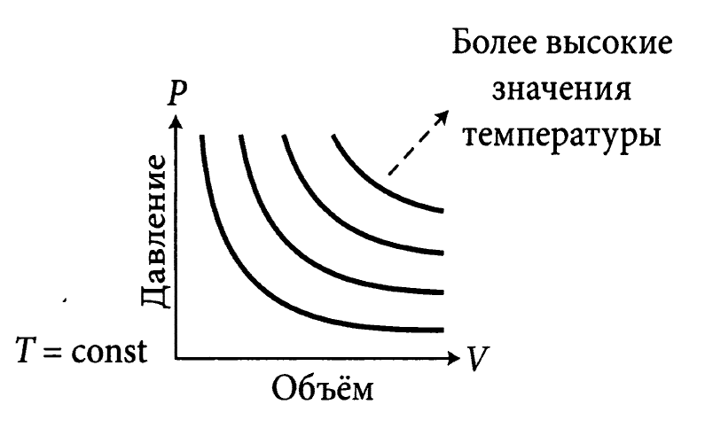

Это означает, что для идеального газа увеличение температуры можно вычислить по формуле
$$
Объем\times\ Изменение\ давления +\ Давление \times \ Изменение\ объема = Изменение\ температуры
$$

## Условия существования экстремумов

Экстремумы функции двух переменных $f(x,y)$ на графике находятся либо на вершине, либо на дне

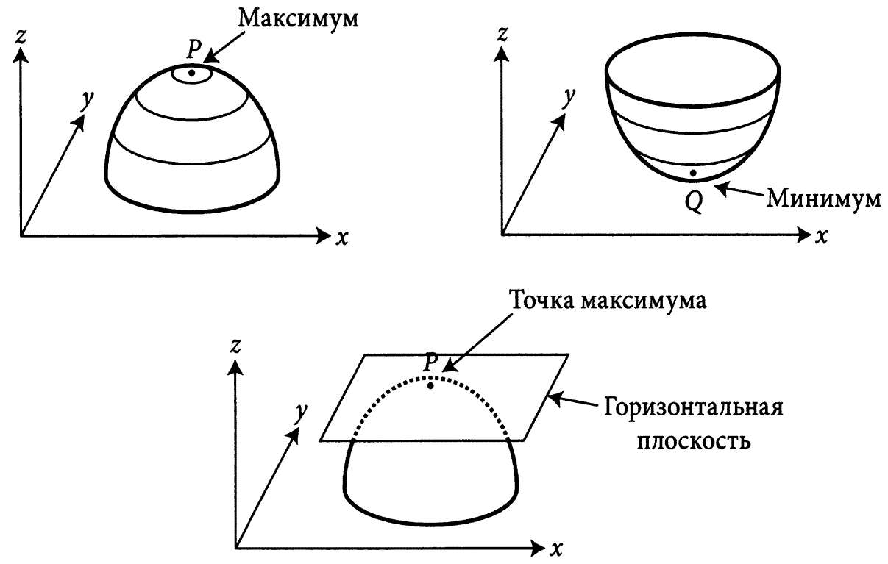

Так как касательные плоскости к графику в точках $P$ и $Q$ параллельны плоскости $x - y$, то они описываются линейной функцией
$$
f(x,y) \approx p(x-a)+q(y-b)+f(a,b),
$$
у которой $p=q=0$.

Так как
$$
p = \frac{\partial f}{\partial x} (=f_x), q = \frac{\partial f}{\partial y} (=f_y),
$$

то условие существования экстремума можно записать так.

Если $f(x,y)$ имеет экстремум в точке $(x,y) = (a,b)$, то можно записать
$$
f_x(a,b) = f_y(a,b) = 0
$$
или
$$
\frac{\partial f}{\partial x} (a,b) = \frac{\partial f}{\partial y} (a,b) = 0
$$
Обратное не верно. То есть, даже если $f_x(a,b) = f_y(a,b) = 0$, существование экстремума в точке $(x,y) = (a,b)$ совсем не обязательно, т.е. это условие только возможности экстремумов.

### Пример

Найдем минимум функции $f(x,y) = (x-y)^2+(y-2)^2$.
Сначала найдем решение алгебраически.

$$
(x-y)^2 \geq 0, (y-2)^2 \geq 0 \Rightarrow f(x,y) = (x-y)^2 + (y-2)^2 \geq 0
$$

Подставим $x = y = 2$.

$f(2,2) = (2-2)^2 + (2-2)^2 = 0$

Отсюда следует, что $f(x,y) \geq f(2,2)$, для $\forall (x,y)$, т.е. $f(x,y)$ имеет минимум, равный $0$ в точке $(x,y) = (2,2)$.

С другой стороны $\displaystyle \frac{\partial f}{\partial x} = 2(x-y)$ и
$\displaystyle \frac{\partial f}{\partial y} = 2(x-y)(-1) + 2(y-2)=-2x+4y - 4$.

Приравняем $\displaystyle \frac{\partial f}{\partial x} = \frac{\partial f}{\partial y} = 0$.

$$
\left\{
\begin{array}{lcl}
2x - 2y & = & 0 \\
-2x + 4y - 4 & = & 0 \\
\end{array}
\right.
$$

Решение - $(x,y) = (2,2)$.

## Применение частных производных в экономике

Валовой внутренний продукт (ВВП), представляющий объем производства в стране за 1год,
делится между людьми и государством друмя путями:
* ВВП распределяется в виде зарплат рабочим
* ВВП распределяется как дивиденты владельцам капитала в форме акций и имущества (станки и оборудование)

Пол Дуглас обнаружил, что в течении 40 лет соотношение между этими двумя путями распределения было почти постоянным,
хотя ситуация в экономике менялась.

С помощью математика Чарльза-Кобба была найдена функция Кобба-Дугласа, объясняющая эти результаты
$$
f(L,K) = \beta \cdot L^{\alpha} \cdot K^{1-\alpha},
$$
где $L$ - зарплата рабочих, $K$ - капитал, $\alpha,\beta$ - константы.

Пусть производство в стране задается функцией производства $f(L,K)$ и будем измерять зарплату в единицах $w$, а капитал - в единицах $r$.
Предположим, что экономическая политика направлена на получение максимальной прибыли, которая задается формулой

$$
П\ = f(L,K) - wL - rK
$$

Так как исходя из экономической политики значения $L$ и $K$ должны соответствовать максимальной прибыли $П$,
то уравнение должно удовлетворять следующим условиям экстремумов:
$$
\frac{\partial П}{\partial L} = \frac{\partial П}{\partial K} = 0
$$

$$
0 = \frac{\partial П}{\partial L} = \frac{\partial f}{\partial L} - \frac{\partial (wL)}{\partial L} - \frac{\partial (rK)}{\partial L} =
\frac{\partial f}{\partial L} - w \Rightarrow w = \frac{\partial f}{\partial L}
$$

$$
0 = \frac{\partial П}{\partial K} = \frac{\partial f}{\partial K} - \frac{\partial (wL)}{\partial K} - \frac{\partial (rK)}{\partial K} =
\frac{\partial f}{\partial K} - r \Rightarrow r = \frac{\partial f}{\partial K}
$$
Т.е. имеем
* Единица зарплаты = Частная производная функция производства по $L$
* Единица капитала = Частная производная функция производства по $K$

Выплаты, которые жители страны получены за работу, равны
$$
Зарплата\times\ Работа\ = wL
$$

Если на зарплату рабочим распределяется $70 \%$ от ВВП, имеем
$$
wL = 0.7\cdot f(L,K)
$$

Аналогично, выплаты владельцам капитала составляет
$$
rK = 0.3\cdot f(L,K)
$$

Из $\displaystyle w=\frac{\partial f}{\partial L}$ и $\displaystyle wL = 0.7\cdot f(L,K) \Rightarrow \frac{\partial f}{\partial L} \times L = 0.7\cdot f(L,K)$.

Аналогично $\displaystyle w=\frac{\partial f}{\partial K}$ и $\displaystyle rK = 0.3\cdot f(L,K) \Rightarrow \frac{\partial f}{\partial K} \times K = 0.3\cdot f(L,K)$.

Кобб нашел функцию $f(L,K)$ удовлетворяющую этим уравнениям:
$$
f(L,K) = \beta \cdot L^{0.7} \cdot K^{0.3},
$$
где $\beta$ - положительный коэффициент, обозначающий уровень развития технологии.

Проверим данную функцию.

$$
\frac{\partial f}{\partial L} \times L=\frac{\beta \cdot L^{0.7} \cdot K^{0.3}}{\partial L} \times L = 0.7 \beta \cdot L^{-0.3} \cdot K^{0.3}\times L^1 = 0.7 \beta \cdot L^{0.7} \cdot K^{0.3}
$$

Аналогично
$$
\frac{\partial f}{\partial K} \times K=\frac{\beta \cdot L^{0.7} \cdot K^{0.3}}{\partial K} \times K = 0.3 \beta \cdot L^{0.7} \cdot K^{-0.7}\times K^1 = 0.3 \beta \cdot L^{0.7} \cdot K^{0.3}
$$

## Частная производная сложной функции. Цепное правило

Производная сложной функции
$$
y=f(x), z=g(y) \rightarrow z=g(f(x))
$$

$$
g(f(x))' = g'(f(x))\cdot f'(x)
$$

Пусть $z$ - функция двух переменных $x$ и $y$, имеющая вид $z=f(x,y)$, а $x$ и $y$ - функция одной переменной $t$,
имеющая вид $x=a(t), y=b(t)$.

Тогда
$$
z = f(x,y)=f(a(t), b(t))
$$

Найдем частную производную $\displaystyle \frac{d z}{d t}$.

Пусть $t=t_0$.
$$
a(t_0) = x_0, b(t_0)=y_0, f(x_0, y_0) = f(a(t_0), b(t_0)) = z_0
$$

Рассмотрим поведение функции вблизи точек $t_0, x_0, y_0$ и $z_0$.

Если найти $\alpha$, такое что
$$
z - z_0 \approx \alpha \times (t-t_0),
$$
то это и будет $\displaystyle \frac{d z}{d t}(t_0)$.

Сначала используем линейное приближение для $x=a(t)$ и $y=b(t)$.

$$
x - x_0 \approx \frac{d a}{d t}(t_0)(t - t_0)
$$

$$
y - y_0 \approx \frac{d b}{d t}(t_0)(t - t_0)
$$

Запишем формулу полного дифференциала функции двух переменных $f(x,y)$
$$
z - z_0 \approx \frac{\partial f}{\partial x}(x_0, y_0)(x - x_0) + \frac{\partial f}{\partial y}(x_0, y_0)(y - y_0)
$$

После подстановки
$$
z - z_0 \approx \frac{\partial f}{\partial x}(x_0, y_0)\frac{d a}{d t}(t_0)(t - t_0) + \frac{\partial f}{\partial y}(x_0, y_0)\frac{d b}{d t}(t_0)(t - t_0) =
$$

$$
\left(\frac{\partial f}{\partial x}(x_0, y_0)\frac{d a}{d t}(t_0) + \frac{\partial f}{\partial y}(x_0, y_0)\frac{d b}{d t}(t_0)\right) (t - t_0)
$$

Сравнивая $z - z_0 \approx \alpha \times (t-t_0)$ и последнюю формулу можно записать следующее
$$
\frac{d z}{d t}(t_0) = \alpha = \frac{\partial f}{\partial x}(x_0, y_0)\frac{d a}{d t}(t_0) + \frac{\partial f}{\partial y}(x_0, y_0)\frac{d b}{d t}(t_0)
$$

Формула для частной производной сложной функции (цепное правило).

Если $z = f(x,y), x=a(t), y=b(t)$, то
$$
\frac{d z}{d t} = \frac{\partial f}{\partial x} \frac{d a}{d t} + \frac{\partial f}{\partial y} \frac{d b}{d t}
$$

### Пример

Фабрика сбрасывает отходы и загрязняет море, сокращая улов рыбаков.

Пусть функция $f(x)$ задает количество товаров, производимых $x$ рабочими на фабрике.

Тогда количество отходов $b = b(f(x))$.

Будем считать, что рыбный улов зависит от численности рабочих $y$ и количества отходов фабрики $b$ и выражается функцией
$g(y,b)$.

Увеличение отходов $b$ вызывает снижение улова, поэтому частная производная $g(y,b)$ по $b$ - отрицательна.

Так как численность рабочих $x$ содержится в функции $g(y,b) = g(y, b(f(x))$,
то производственная деятельность фабрики влияет на рыболовство, хотя и не учитывается при формировании рыночной цены.
Это внешнее воздействие называется _экстерналиями_.

Что будет, если фабрика и рыболовство будут действовать только в целях собственной выгоды.

Пусть зарплата на обоих предприятиях равна $w$, цена товара, произведенного на фабрике - $p$,
а цена выловленной рыбы - $q$.

Тогда прибыль фабрики
$$
П_1 (x) = p\cdot f(x) - wx
$$

Фабрика стремится к максимальной прибыли $\Rightarrow$
$$
\frac{\partial П_1}{\partial x} = p\cdot f'(x)-w = 0 \Rightarrow p\cdot f'(x) = w
$$

Пусть $x = x^*$ удовлетворяет этому условию, то есть
$$
p\cdot f'(x^*) = w
$$

Здесь $x^*$ - оптимальное количество рабочих на фабрике, а $f(x^*)$ - количество производимых фабрикой товаров.

Тогда количество отходов будет
$$
b^* = b(f(x^*))
$$

Прибыль от рыболовства $П_2$ задается формулой
$$
П_2 = q\cdot g(y,b) - wy
$$

Так как количество отходов фабрики задается формулой $b^* = b(f(x^*))$ и не зависит от рыболовства,
то прибыль от рыболовства практически становится функцией одной перменной $y$.

$$
П_2 = q\cdot g(y,b^*) - wy
$$

Поэтому, чтобы найти максимум $П_2$, достаточно выполнить только одно условие экстремума функции двух переменных -
частной производной по $y$.

$$
\frac{\partial П_2}{\partial y} = q\cdot \frac{\partial g}{\partial y}(y,b^*)-w = 0 \Longleftrightarrow q\cdot \frac{\partial g}{\partial y}(y,b^*) = w
$$

Отсюда оптимальное количество товаров на фабрике и оптимальный улов рыбы, при условии х независимости друг от друга,
определяется как $f(x^*)$ и $g(y^*,b^*)$, где $x^*$ и $y^*$ удовлетворяют условиям
$$
p\cdot f'(x^*) = w, b^* = b(f(x^*)), q\cdot\frac{\partial q}{\partial y}(y^*, b^*)=w
$$

Чтобы учесть интерес и фабрики, и рыболовства нужно найти условия максимума для суммы прибылей от обоих видов деятельности
$$
П_3 = p\cdot f(x) q\cdot g(y,b) - wx - wy
$$

Так как $П_3$ - функция двух переменных, то условия экстремума
$$
\frac{\partial П_3}{\partial x} = \frac{\partial П_3}{\partial y} = 0
$$

Рассмотрим первую частную производную
$$
\frac{\partial П_3}{\partial x} = p\cdot f'(x) + q\cdot \frac{\partial g(y, b(f(x)))}{\partial x} - w =
$$

воспользуемся правилос дифференцирования функций от функции
$$
p\cdot f'(x) + q\cdot \frac{\partial g}{\partial b}(y, b(f(x)))\cdot b'(f(x))\cdot f'(x) - w
$$

Таким образом
$$
\frac{\partial П_3}{\partial x} = 0 \Longleftrightarrow \left( p + q\cdot \frac{\partial g}{\partial b}(y, b(f(x)))\cdot b'(f(x)) \right)\cdot f'(x) = w
$$

Аналогичным образом получаем условие для второй частной производной
$$
\frac{\partial П_3}{\partial y} = 0 \Longleftrightarrow q\cdot \frac{\partial g}{\partial y}(y, b(f(x))) = w
$$

Таким образом, с точки зрения общества оптимальное количество рабочих $x^{**}$ - для фабрики $y^{**}$ - для рыболовства определяется из формул:
$$
\left(p+q\frac{\partial q}{\partial b}(y^{**}, b(f(x^{**})))b'(f(x^{**}))\right)f'(x^{**}) = w
$$

$$
q\frac{\partial q}{\partial y}(y^{**}, b(f(x^{**}))) = w
$$

Сравним формулы
$$
p\times f'(x^{*}) = w
$$
и
$$
(p + \hearts)\times f'(x^{**}) = w,
$$
где $\displaystyle \hearts=q \frac{\partial g}{\partial b} b'(f(x^{**}))$

Тка как $\hearts$ отрицательно, то $p + \hearts \lt p$, а так как правые части порознь равны $w$, то $\Rightarrow f'(x^{**}) \gt f'(x^{*})$, т.е. кривая $f(x)$ выглядит так

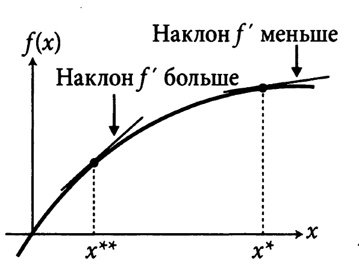

Для достижения максимальной пользы для общества фабрике нужно уменьшить производство от $x^*$, соответствующего выгоде только для фабрики, до $x^{**}$.

Можно ввести налог.

Если установить величину налога на единицу товара, произведенного фабрикой равной $\hearts$

$$
- \hearts = - q \frac{\partial g}{\partial b} b'(f(x^{**})),
$$
то прибыль, учитывающая только интересы фабрики
$$
П_1(x) =pf(x)-wx-(-\hearts f(x))
$$
и условия экстремума для этой функции будет
$$
\frac{\partial П_1}{\partial x} = p f'(x) -w+\hearts f'(x) = 0 \Longleftrightarrow (p + \hearts)f'(x) = w
$$

### Производная наявно заданной функции

Множество точек $(x,y)$, в которых функция двух переменных $f(x,y)$ равна константе $c$, образуют график, удовлетворяющий условию $f(x,y) = c$.

Если часть этого графика имеет вид функции одной переменной $y=h(x)$, то такая функция называется _неявно заданной функции_.

Неявная функция $h(x)$ удовлетворяет равенству $f(x, h(x)) = c$, для всех $x$ в области определения.

Найдем производную неявной функции $h(x)$.

Полный дифференциал функции $z=f(x,y)$ записывается как $d z = f_x d x + f_y d y$.
Если точка $(x,y)$ перемещается по поверхности $f(x,y) = c$, то значение функции $f(x,y)$ не меняется, а значит и дифференциал $d z$ тоже равен $0$.

Получаем $0 = f_x d x + f_y d y$.

Считая, что $f_q \neq 0$, преобразуем это выражение к виду
$$
\frac{dy}{dx} = -\frac{f_x}{f_y}.
$$

Левая часть - производная от $h(x)$.
$$
h'(x) = -\frac{f_x}{f_y}.
$$

### Пример

График функции $f(x,y) = x^2 + y^2 = r^2$ представляет собой окружность радиуса $r$ с центром в начале координат.

Считая, что $x^2 \neq r^2$ используем неявную функцию $f(x,y) = x^2 + y^2 = r^2$, чтобы найти производную явных функций $y = h(x) = \sqrt{r^2 - x^2}$ и $y = h(x) = - \sqrt{r^2 - x^2}$.

Используя формулу производной неявной функции получаем:
$$
h'(x) = - \frac{f_x}{f_y} = - \frac{x}{y}
$$

## Упражнения

### 1
Найти $f_x$ и $f_y$ для $f(x,y) = x^2 + 2 xy + 3 y^2$

$$
f_x = 2x _ 2y, f_y = 2 + 6y
$$

### 2
Период колебаний $T$ маятника длиной $L$ под действием ускорения силы тяжести $g$ задается формулой
$$
T = 2\pi \sqrt{\frac{L}{g}} = 2\pi g^{-1/2}L^{1/2}
$$

Ускорение $g$ зависит от высоты над уровнем моря.

* Найти выражение для полногго дифференциалы $T$

* Если $L$ удлинить на $1%$, $g$ уменьшить на $2%$, на сколько процентов увеличится $T$?

Полный дифференциал имеет вид
$$
dT = \frac{\partial T}{\partial g} dg + \frac{\partial T}{\partial L} dL = -\pi g^{-3/2} L^{1/2} dg + \pi g^{-1/2}L^{-1/2} dL,
$$
откуда
$$
\Delta T \approx -\pi g^{-3/2}L^{1/2} \varDelta g + \pi g^{-1/2}L^{-1/2}\varDelta L
$$

Подставляя $\varDelta g = -0.02 g$ и $\varDelta L = 0.01 L$, получаем
$$
\Delta T \approx 0.02\pi g^{-3/2}L^{1/2}g + 0.01\pi g^{-1/2}L^{-1/2}L = 0.03 \pi g^{-1/2}L^{1/2} = 0.02\frac{T}{2} = 0.015 T
$$

Таким образом, $T$ увеличилась на $1.5%$.

### 3
Вывести формулу производной $h(x)$ неявной функции $f(x,y)=c$, используя правило дифференцирования функции от функции

Можно записать, что $f(x, h(x)) = c$ вблизи $x$.
Используя цепное правило дифференцирования сложной функции, находим
$$
\frac{df}{dx} = 0, \frac{df}{dx}=f_x + f_y h'(x) = 0,
$$
откуда
$$
h'(x) = - \frac{f_x}{f_y}
$$
